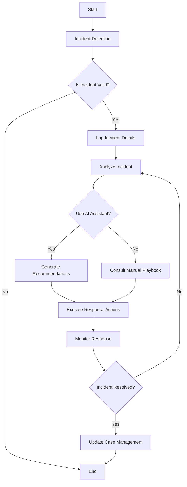
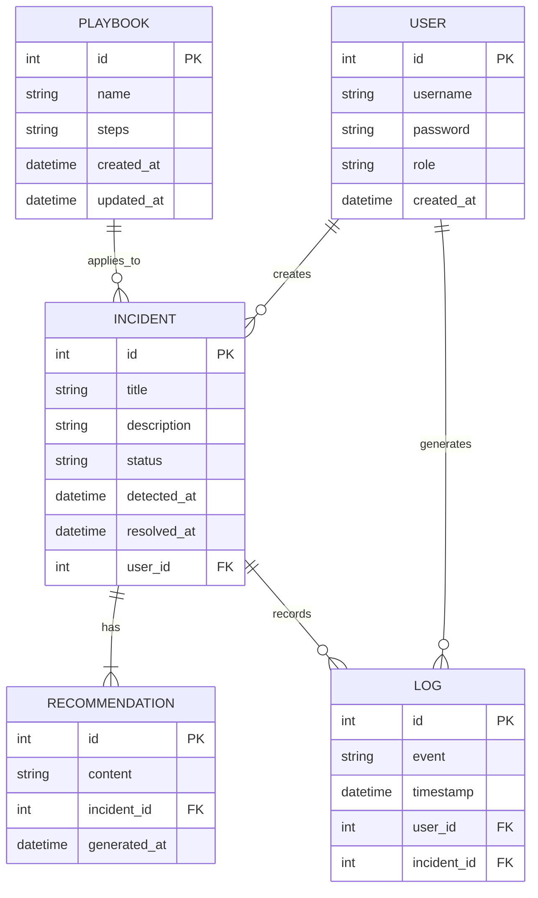
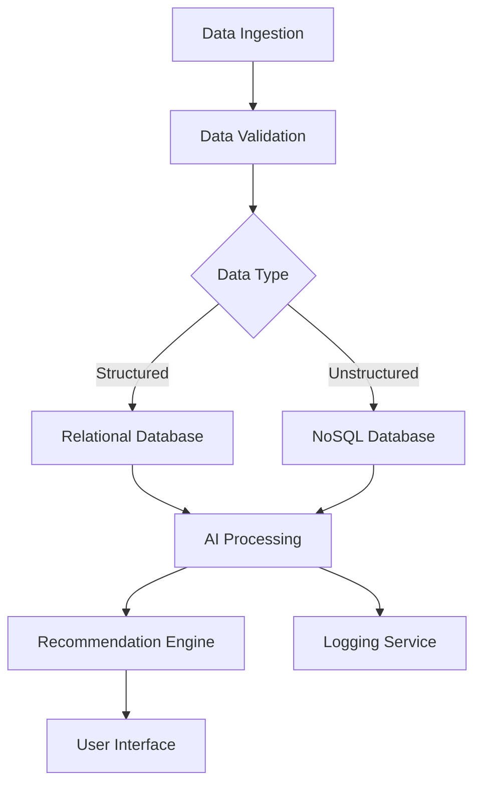

```markdown
# 1. Introduction

## 1.1 Purpose
The purpose of this Software Requirements Specification (SRS) document is to provide a comprehensive and detailed description of the requirements for the Generative AI-Powered Security Orchestration Platform. It is intended to serve as a guide for developers, stakeholders, and other relevant parties to ensure that the system meets its intended objectives and functionalities.

## 1.2 Scope
The Generative AI-Powered Security Orchestration Platform is designed to optimize cybersecurity operations by automating incident response, integrating AI-generated playbooks, and providing real-time support for security analysts. The platform aims to enhance the efficiency and effectiveness of security teams through intelligent automation, advanced threat analysis, and seamless integration with existing security infrastructures. Core functionalities include incident response automation, AI-powered assistance, advanced security monitoring, and comprehensive case management, all supported by scalable architecture and robust data management practices.
```

```markdown
# 2. Product Description

## 2.1 Product Perspective
The Generative AI-Powered Security Orchestration Platform is designed to integrate seamlessly within existing cybersecurity ecosystems. It operates as a central hub that connects with various security tools such as Splunk and XSOAR, leveraging their capabilities to enhance incident response and threat management. By utilizing API-based communication, the platform ensures interoperability with third-party threat intelligence feeds and supports custom integrations through its well-documented API. The scalable architecture allows it to function effectively in both on-premises and cloud environments, providing a unified interface for security analysts to manage and respond to threats dynamically.

## 2.2 Product Functions
The platform offers a comprehensive suite of functions aimed at optimizing cybersecurity operations:

- **Incident Response Automation**: Automates the entire incident response lifecycle, from detection to resolution, using AI-generated and pre-defined playbooks.
- **Dynamic Playbook Generation**: Utilizes AI to create and adapt playbooks in real-time based on emerging threats and organizational policies.
- **Real-Time Recommendations**: Provides context-aware, actionable insights to security analysts during incidents.
- **Interactive AI Assistant**: Facilitates user interaction through a conversational interface, offering suggestions and resolving inquiries related to security operations.
- **Advanced Security Monitoring**: Offers real-time tracking of incidents and alerts, enabling immediate adjustments to workflows.
- **Comprehensive Case Management**: Logs all incident details, maintains audit trails, and allows for easy retrieval and analysis of historical data.
- **Dashboard Integration**: Provides customizable dashboards displaying key metrics, incident statuses, and performance outcomes.
- **User and System Management**: Enables user role assignments, system configurations, and management of integrations and analytics.

## 2.3 User Characteristics
The platform is intended for use by a range of security professionals with varying levels of expertise:

- **Security Analysts**
  - **Expertise Level**: Intermediate to advanced knowledge of cybersecurity principles and incident response.
  - **Persona**: Frontline defenders responsible for monitoring, detecting, and responding to security incidents. They require tools that enhance their efficiency and provide intelligent assistance during complex investigations.
  
- **Administrators**
  - **Expertise Level**: Advanced understanding of cybersecurity infrastructure, user management, and system configurations.
  - **Persona**: Individuals responsible for managing the platform, configuring integrations, overseeing user permissions, and ensuring the system's overall performance and security compliance.
  
- **IT Managers**
  - **Expertise Level**: Broad knowledge of IT operations, cybersecurity strategies, and management practices.
  - **Persona**: Decision-makers who oversee the security operations, evaluate system performance metrics, and ensure that the platform aligns with organizational objectives and compliance requirements.

## 2.4 Constraints
The development and deployment of the platform are subject to several constraints:

- **Regulatory Compliance**: Must adhere to industry standards such as GDPR, HIPAA, and PCI DSS, necessitating robust data protection and privacy measures.
- **Technical Limitations**: Dependence on integration with existing security tools and APIs; performance must remain optimal under high load conditions.
- **Budgetary Restrictions**: Development and maintenance costs must align with allocated budgets, potentially limiting the scope of features and scalability.
- **Resource Availability**: Availability of skilled personnel for AI model training, system maintenance, and user support may impact project timelines.
- **Time Constraints**: Project milestones must be met within specified deadlines to ensure timely deployment and return on investment.

## 2.5 Assumptions and Dependencies
The successful development and operation of the platform rely on several assumptions and dependencies:

- **Assumptions**
  - Organizations have existing security infrastructure that supports integration with the platform.
  - Users possess a baseline level of cybersecurity knowledge to effectively interact with the platform.
  - Continuous access to up-to-date threat intelligence feeds is available to inform AI-generated playbooks.
  
- **Dependencies**
  - **Third-Party Integrations**: Reliable APIs and support from integrated security tools such as Splunk and XSOAR.
  - **AI and Machine Learning Models**: Continuous access to data for training and updating AI models to maintain effectiveness.
  - **Infrastructure**: Availability of scalable cloud or on-premises infrastructure to support the platform's performance and growth.
  - **Regulatory Bodies**: Ongoing compliance requirements and potential changes in industry standards that may necessitate platform updates.
  - **External Threat Intelligence Providers**: Dependence on the accuracy and timeliness of external threat data to ensure the platform's proactive response capabilities.
```

```markdown
# PROCESS FLOWCHART


```

```markdown
# 3. Functional Requirements

## 3.1 Incident Response Automation

### 3.1.1 ID
FR-IR-001

### 3.1.2 DESCRIPTION
Automates the entire incident response lifecycle, from detection to resolution, utilizing both AI-generated and pre-defined playbooks to ensure consistent and efficient handling of security incidents.

### 3.1.3 PRIORITY
High

| Functional Requirement ID | Description                                                         | Priority |
|---------------------------|---------------------------------------------------------------------|----------|
| FR-IR-001-1               | Automatically detect and log security incidents.                   | High     |
| FR-IR-001-2               | Generate AI-driven playbooks based on real-time threat intelligence.| High     |
| FR-IR-001-3               | Execute response actions as per the playbook instructions.          | High     |
| FR-IR-001-4               | Provide real-time status updates on playbook execution progress.    | Medium   |
| FR-IR-001-5               | Adapt and update playbooks dynamically during an ongoing incident.  | Medium   |

## 3.2 Dynamic Playbook Generation

### 3.2.1 ID
FR-DPG-002

### 3.2.2 DESCRIPTION
Utilizes artificial intelligence to create and modify security playbooks in real-time based on emerging threats and organizational policies, ensuring that response strategies are up-to-date and effective.

### 3.2.3 PRIORITY
High

| Functional Requirement ID | Description                                                         | Priority |
|---------------------------|---------------------------------------------------------------------|----------|
| FR-DPG-002-1              | Generate standardized playbooks compatible with XSOAR integrations.| High     |
| FR-DPG-002-2              | Incorporate new threat intelligence into playbook generation.       | High     |
| FR-DPG-002-3              | Validate and ensure compliance of generated playbooks with policies.| Medium   |
| FR-DPG-002-4              | Allow manual adjustments to AI-generated playbooks by administrators.| Low      |

## 3.3 Playbook Execution

### 3.3.1 ID
FR-PE-003

### 3.3.2 DESCRIPTION
Automatically triggers and manages the execution of incident response actions based on predefined or AI-generated workflows, ensuring timely and effective resolution of security incidents.

### 3.3.3 PRIORITY
High

| Functional Requirement ID | Description                                                         | Priority |
|---------------------------|---------------------------------------------------------------------|----------|
| FR-PE-003-1               | Automatically initiate playbook execution upon incident detection. | High     |
| FR-PE-003-2               | Integrate seamlessly with existing XSOAR playbooks.                | High     |
| FR-PE-003-3               | Track and report the progress of playbook execution in real-time.   | Medium   |
| FR-PE-003-4               | Enable rollback or modification of response actions if necessary.  | Low      |

## 3.4 Case Management

### 3.4.1 ID
FR-CM-004

### 3.4.2 DESCRIPTION
Logs all incident details, maintains comprehensive audit trails, and provides easy retrieval and analysis of historical data to support ongoing security operations and compliance requirements.

### 3.4.3 PRIORITY
High

| Functional Requirement ID | Description                                                         | Priority |
|---------------------------|---------------------------------------------------------------------|----------|
| FR-CM-004-1               | Automatically log incident details, including AI-generated insights.| High     |
| FR-CM-004-2               | Maintain audit trails linking AI recommendations with analyst actions.| High     |
| FR-CM-004-3               | Provide search and retrieval capabilities for historical incident data.| Medium |
| FR-CM-004-4               | Enable export of incident logs for reporting and compliance purposes.| Low      |

## 3.5 Real-Time Recommendations

### 3.5.1 ID
FR-RTR-005

### 3.5.2 DESCRIPTION
Provides actionable, context-aware recommendations to security analysts during incident investigations, prioritizing actions based on potential impact and urgency to enhance decision-making.

### 3.5.3 PRIORITY
High

| Functional Requirement ID | Description                                                         | Priority |
|---------------------------|---------------------------------------------------------------------|----------|
| FR-RTR-005-1              | Generate actionable recommendations based on current incident context.| High    |
| FR-RTR-005-2              | Prioritize recommendations by impact and urgency.                   | High     |
| FR-RTR-005-3              | Update recommendations in real-time as incident data evolves.       | Medium   |
| FR-RTR-005-4              | Allow analysts to provide feedback on recommendation relevance.     | Low      |

## 3.6 Interactive AI Assistant

### 3.6.1 ID
FR-IAA-006

### 3.6.2 DESCRIPTION
Facilitates user interaction through a conversational interface, offering suggestions, resolving inquiries, and providing guidance related to security operations based on best practices and learned patterns.

### 3.6.3 PRIORITY
Medium

| Functional Requirement ID | Description                                                         | Priority |
|---------------------------|---------------------------------------------------------------------|----------|
| FR-IAA-006-1              | Implement a natural language chat interface for user interactions.  | High     |
| FR-IAA-006-2              | Provide context-aware suggestions and auto-complete functionality.  | High     |
| FR-IAA-006-3              | Differentiate clearly between AI-generated content and human inputs.| Medium   |
| FR-IAA-006-4              | Log all interactions for analysis and improvement of the AI assistant.| Low    |

## 3.7 Advanced Security Monitoring

### 3.7.1 ID
FR-ASM-007

### 3.7.2 DESCRIPTION
Offers real-time tracking of incidents and alerts, enabling immediate adjustments to workflows and providing customizable alerts for critical events or threshold breaches to ensure continuous security vigilance.

### 3.7.3 PRIORITY
High

| Functional Requirement ID | Description                                                         | Priority |
|---------------------------|---------------------------------------------------------------------|----------|
| FR-ASM-007-1              | Track incident response actions and alerts in real-time.            | High     |
| FR-ASM-007-2              | Enable immediate adjustments to workflows based on threat changes.  | High     |
| FR-ASM-007-3              | Provide customizable alerts for critical events or threshold breaches.| Medium |
| FR-ASM-007-4              | Integrate monitoring data with dashboards for comprehensive visibility.| Low    |

## 3.8 Dashboard Integration

### 3.8.1 ID
FR-DI-008

### 3.8.2 DESCRIPTION
Provides customizable dashboards that display key metrics, incident statuses, and performance outcomes, allowing users to tailor views according to their roles and preferences for enhanced situational awareness.

### 3.8.3 PRIORITY
Medium

| Functional Requirement ID | Description                                                         | Priority |
|---------------------------|---------------------------------------------------------------------|----------|
| FR-DI-008-1               | Implement a high-level overview dashboard of all incidents.         | High     |
| FR-DI-008-2               | Display performance metrics for automated and AI-enhanced actions.  | High     |
| FR-DI-008-3               | Allow customization of dashboard views and filtering options.       | Medium   |
| FR-DI-008-4               | Enable interactive visualizations for threat trends and system performance.| Low  |

## 3.9 User and System Management

### 3.9.1 ID
FR-USM-009

### 3.9.2 DESCRIPTION
Enables comprehensive management of users and system configurations, including role assignments, integration setups, and analytics management to maintain platform security and operational efficiency.

### 3.9.3 PRIORITY
High

| Functional Requirement ID | Description                                                         | Priority |
|---------------------------|---------------------------------------------------------------------|----------|
| FR-USM-009-1              | Assign and manage user roles and permissions.                       | High     |
| FR-USM-009-2              | Configure system settings and manage integrations with third-party tools.| High  |
| FR-USM-009-3              | Monitor and manage system analytics and performance metrics.        | Medium   |
| FR-USM-009-4              | Implement multi-factor authentication and strict access controls.   | Low      |
```

```markdown
# 4. NON-FUNCTIONAL REQUIREMENTS

## 4.1 Performance

### 4.1.1 ID
NFR-PERF-001

### 4.1.2 DESCRIPTION
Defines the performance expectations to ensure the platform operates efficiently under expected load conditions.

### 4.1.3 PRIORITY
High

| Non-Functional Requirement ID | Description                                                          | Priority |
|-------------------------------|----------------------------------------------------------------------|----------|
| NFR-PERF-001-1                | Average response time for AI-generated recommendations must be under 2 seconds. | High     |
| NFR-PERF-001-2                | Support at least 1000 concurrent users without performance degradation. | High     |
| NFR-PERF-001-3                | Throughput should allow processing of a minimum of 500 security incidents per hour. | Medium   |
| NFR-PERF-001-4                | Optimize CPU and memory utilization to maintain system performance below 75% under peak load. | Medium   |

## 4.2 Safety

### 4.2.1 ID
NFR-SAFETY-002

### 4.2.2 DESCRIPTION
Ensures the safety and integrity of user data and system operations in the event of failures or unexpected conditions.

### 4.2.3 PRIORITY
High

| Non-Functional Requirement ID | Description                                                        | Priority |
|-------------------------------|--------------------------------------------------------------------|----------|
| NFR-SAFETY-002-1              | Implement automatic failover mechanisms to maintain system availability during failures. | High     |
| NFR-SAFETY-002-2              | Ensure data integrity through regular backups and redundancy.      | High     |
| NFR-SAFETY-002-3              | Provide clear and immediate error messages to users in case of system failures. | Medium   |
| NFR-SAFETY-002-4              | Implement recovery procedures to restore full functionality within 30 minutes of a failure. | Medium   |

## 4.3 Security

### 4.3.1 ID
NFR-SEC-003

### 4.3.2 DESCRIPTION
Ensures the platform is secure against unauthorized access, data breaches, and other security threats through robust authentication, authorization, data encryption, and privacy measures.

### 4.3.3 PRIORITY
High

| Non-Functional Requirement ID | Description                                                                 | Priority |
|-------------------------------|-----------------------------------------------------------------------------|----------|
| NFR-SEC-003-1                 | Implement multi-factor authentication for all user access.                  | High     |
| NFR-SEC-003-2                 | Enforce role-based access control (RBAC) to restrict user permissions.     | High     |
| NFR-SEC-003-3                 | Encrypt all data at rest and in transit using industry-standard encryption protocols. | High     |
| NFR-SEC-003-4                 | Conduct regular security audits and vulnerability assessments.             | Medium   |
| NFR-SEC-003-5                 | Ensure compliance with privacy regulations such as GDPR and HIPAA.         | High     |

## 4.4 Quality

### 4.4.1 ID
NFR-QUAL-004

### 4.4.2 DESCRIPTION
Defines quality attributes to ensure the platform is reliable, maintainable, usable, and scalable to meet ongoing operational needs.

### 4.4.3 PRIORITY
High

| Non-Functional Requirement ID | Description                                                                  | Priority |
|-------------------------------|------------------------------------------------------------------------------|----------|
| NFR-QUAL-004-1                | Achieve 99.99% system availability for critical components.                 | High     |
| NFR-QUAL-004-2                | Ensure the system is maintainable with a modular architecture and clear documentation. | Medium   |
| NFR-QUAL-004-3                | Provide an intuitive and user-friendly interface for all user roles.         | High     |
| NFR-QUAL-004-4                | Ensure the platform can scale horizontally to accommodate increasing users and data volumes. | High     |
| NFR-QUAL-004-5                | Maintain high reliability with minimal downtime and quick recovery from failures. | High     |

## 4.5 Compliance

### 4.5.1 ID
NFR-COMP-005

### 4.5.2 DESCRIPTION
Ensures the platform adheres to all relevant legal, regulatory, and industry standards to guarantee lawful and ethical operation.

### 4.5.3 PRIORITY
High

| Non-Functional Requirement ID | Description                                                                  | Priority |
|-------------------------------|------------------------------------------------------------------------------|----------|
| NFR-COMP-005-1                | Comply with GDPR, HIPAA, PCI DSS, and other relevant data protection regulations. | High     |
| NFR-COMP-005-2                | Maintain comprehensive audit logs to support regulatory requirements.        | Medium   |
| NFR-COMP-005-3                | Implement data retention and deletion policies in accordance with legal standards. | High     |
| NFR-COMP-005-4                | Ensure ongoing compliance through regular reviews and updates to meet changing regulations. | Medium   |
```

```markdown
# 5. Data Requirements

## 5.1 Data Models

The data model for the Generative AI-Powered Security Orchestration Platform encompasses various entities and their relationships to ensure comprehensive data management and integrity.



## 5.2 Data Storage

The platform employs robust data storage strategies to ensure data integrity, availability, and compliance with retention policies.

| Storage Aspect        | Details                                                                                                     |
|-----------------------|-------------------------------------------------------------------------------------------------------------|
| **Database Systems**  | Utilizes a relational database (e.g., PostgreSQL) for structured data and a NoSQL database (e.g., MongoDB) for unstructured data. |
| **Data Retention**    | 
- **Incidents**: Retained for 7 years to comply with regulatory requirements.
- **Logs**: Stored for 5 years with indexing for efficient retrieval.
- **Playbooks**: Retained indefinitely with versioning for audit purposes.
|
| **Redundancy**        | 
- Data is replicated across multiple data centers to ensure high availability.
- Implements database clustering and failover mechanisms.
|
| **Backup**            | 
- Daily incremental backups and weekly full backups.
- Backups are encrypted and stored in geographically separated locations.
|
| **Recovery**          | 
- Point-in-time recovery capabilities for databases.
- Automated backup restoration testing to ensure reliability.
|

## 5.3 Data Processing

Data processing within the platform is designed to maintain high security and integrity throughout data flows.



### Data Security

- **Encryption**: All data is encrypted both at rest and in transit using TLS 1.2+ and AES-256 standards.
- **Access Control**: Implements Role-Based Access Control (RBAC) to restrict data access based on user roles.
- **Data Anonymization**: Sensitive data is anonymized where applicable to protect user privacy.
- **Integrity Checks**: Regular checksums and hash verifications are performed to ensure data integrity.
- **Secure APIs**: All API endpoints are secured with authentication tokens and input validation to prevent unauthorized access and injection attacks.

### Data Processing Workflow

1. **Data Ingestion**: Data from integrated security tools and external threat intelligence feeds is ingested through secure APIs.
2. **Data Validation**: Incoming data is validated for format, completeness, and integrity before processing.
3. **Data Storage**: Validated data is stored in appropriate databases based on its type.
4. **AI Processing**: Machine learning models analyze the data to generate insights and recommendations.
5. **Recommendation Engine**: Provides actionable recommendations to security analysts based on AI processing results.
6. **User Interface**: Displays processed data and recommendations through customizable dashboards and interfaces.
7. **Logging Service**: All data processing activities are logged for auditing and compliance purposes.
```

```markdown
# 6. External Interfaces

## 6.1 User Interfaces

The user interface (UI) of the Generative AI-Powered Security Orchestration Platform is designed to provide security analysts, administrators, and IT managers with intuitive and efficient tools to manage and respond to security incidents.

### 6.1.1 Dashboard

- **Description**: Customizable dashboards display key metrics, incident statuses, and performance outcomes. Users can tailor their views according to their roles and preferences.
- **Mockup Placeholder**: 

### 6.1.2 Incident Management Interface

- **Description**: Provides clear, step-by-step guidance through incident response processes, visual representation of playbook execution progress, and easy access to AI recommendations and historical data.
- **Mockup Placeholder**: 

### 6.1.3 AI Assistant Interface

- **Description**: Features a natural language chat interface for interacting with the AI assistant, context-aware suggestions, and auto-complete functionality. Differentiates between AI-generated content and human inputs.
- **Mockup Placeholder**: 

## 6.2 Software Interfaces

The platform interacts with various external software systems to enhance its functionality and integrate seamlessly within existing cybersecurity ecosystems.

### 6.2.1 Security Information and Event Management (SIEM) Systems

- **Description**: Integrates with SIEM tools such as Splunk to ingest security event data for analysis and incident detection.
- **Interface Specifications**:
  - **API**: RESTful APIs for data ingestion and event querying.
  - **Data Formats**: JSON and XML for data exchange.
  - **Authentication**: OAuth 2.0 for secure API access.

### 6.2.2 Security Orchestration, Automation, and Response (SOAR) Platforms

- **Description**: Connects with SOAR platforms like XSOAR to leverage existing playbooks and automate response actions.
- **Interface Specifications**:
  - **API**: RESTful APIs for playbook execution and status monitoring.
  - **Data Formats**: JSON for request and response payloads.
  - **Authentication**: API keys or OAuth 2.0.

### 6.2.3 Threat Intelligence Feeds

- **Description**: Consumes threat intelligence data from third-party providers to inform AI-generated playbooks and recommendations.
- **Interface Specifications**:
  - **API**: RESTful APIs for real-time access to threat data.
  - **Data Formats**: STIX, TAXII, JSON.
  - **Authentication**: API keys or token-based authentication.

### 6.2.4 Other Integrations

- **Description**: Supports custom integrations with additional security tools through a well-documented API.
- **Interface Specifications**:
  - **API**: RESTful APIs with support for Webhooks.
  - **Data Formats**: JSON, XML.
  - **Authentication**: OAuth 2.0, API keys.

## 6.3 Communication Interfaces

Defines the protocols, data formats, and interaction methods used for communication between the Generative AI-Powered Security Orchestration Platform and external systems.

### 6.3.1 API Communication

- **Protocols**: RESTful APIs over HTTPS using TLS 1.2+ for secure data transmission.
- **Data Formats**: JSON for data exchange; support for XML where necessary.
- **Authentication**: OAuth 2.0, API keys, and token-based authentication methods.

### 6.3.2 Messaging Protocols

- **Protocols**: Supports AMQP and MQTT for real-time data streaming and event-driven communication.
- **Use Cases**: Real-time incident alerts, status updates, and communication with IoT devices if applicable.

### 6.3.3 Data Exchange Standards

- **Standards**: Utilizes industry-standard formats such as STIX and TAXII for threat intelligence data exchange.

### 6.3.4 Webhooks

- **Description**: Supports webhooks for real-time notifications and integrations with external systems.
- **Configuration**: Allows users to configure webhook endpoints for specific event types.
```

```markdown
# APPENDICES

## GLOSSARY

| Term                        | Definition                                                                                     |
|-----------------------------|------------------------------------------------------------------------------------------------|
| **AI (Artificial Intelligence)** | Technology that enables machines to mimic human intelligence, including learning and problem-solving. |
| **API (Application Programming Interface)** | A set of protocols and tools for building software and enabling communication between different software applications. |
| **GDPR (General Data Protection Regulation)** | A regulation in EU law on data protection and privacy for individuals within the European Union. |
| **HIPAA (Health Insurance Portability and Accountability Act)** | A US legislation that provides data privacy and security provisions for safeguarding medical information. |
| **PCI DSS (Payment Card Industry Data Security Standard)** | A set of security standards designed to ensure that all companies that accept, process, store or transmit credit card information maintain a secure environment. |
| **RBAC (Role-Based Access Control)** | A method of regulating access to resources based on the roles of individual users within an organization. |
| **SIEM (Security Information and Event Management)** | A solution that provides real-time analysis of security alerts generated by applications and network hardware. |
| **SOAR (Security Orchestration, Automation, and Response)** | Technologies that enable organizations to collect security threats data and respond to security events with little or no human assistance. |
| **TLS (Transport Layer Security)** | A cryptographic protocol designed to provide secure communication over a computer network. |
| **STIX (Structured Threat Information Expression)** | A language and serialization format used to exchange cyber threat intelligence (CTI). |
| **TAXII (Trusted Automated eXchange of Indicator Information)** | A set of protocols for exchanging cyber threat information using STIX. |
| **MTTD (Mean Time to Detect)** | The average time taken to detect a security incident. |
| **MTTR (Mean Time to Respond)** | The average time taken to respond to and resolve a security incident. |

## ACRONYMS

| Acronym | Expanded Form                                              |
|---------|------------------------------------------------------------|
| AI      | Artificial Intelligence                                    |
| API     | Application Programming Interface                          |
| GDPR    | General Data Protection Regulation                         |
| HIPAA   | Health Insurance Portability and Accountability Act        |
| PCI DSS | Payment Card Industry Data Security Standard               |
| RBAC    | Role-Based Access Control                                  |
| SIEM    | Security Information and Event Management                 |
| SOAR    | Security Orchestration, Automation, and Response          |
| TLS     | Transport Layer Security                                   |
| STIX    | Structured Threat Information Expression                   |
| TAXII   | Trusted Automated eXchange of Indicator Information        |
| MTTD    | Mean Time to Detect                                        |
| MTTR    | Mean Time to Respond                                       |

## ADDITIONAL REFERENCES

- **ISO/IEC 27001:2013**: Information Security Management Systems — Requirements.
- **NIST SP 800-53**: Security and Privacy Controls for Information Systems and Organizations.
- **OWASP Top Ten**: A standard awareness document for developers and web application security.
- **Splunk Documentation**: [https://docs.splunk.com](https://docs.splunk.com)
- **XSOAR Documentation**: [https://xsoar.pan.dev](https://xsoar.pan.dev)
- **PostgreSQL Documentation**: [https://www.postgresql.org/docs/](https://www.postgresql.org/docs/)
- **MongoDB Documentation**: [https://docs.mongodb.com/](https://docs.mongodb.com/)
- **OAuth 2.0 Specifications**: [https://oauth.net/2/](https://oauth.net/2/)
- **RESTful API Design Guidelines**: [https://restfulapi.net/](https://restfulapi.net/)
- **TLS 1.2 Specification**: [https://tools.ietf.org/html/rfc5246](https://tools.ietf.org/html/rfc5246)
```