## 1. Introduction

### 1.1 System Objectives

- **Automate Incident Response**: Streamline the response process to security incidents by utilizing AI-driven playbooks and automated workflows to reduce response times and minimize human error.
- **Enhance Threat Intelligence Integration**: Integrate real-time threat intelligence feeds to keep the platform updated with the latest threat information, enabling proactive defense mechanisms.
- **Provide Intelligent Assistance**: Offer AI-powered recommendations and an interactive assistant to support security analysts in decision-making and complex incident handling.
- **Improve Security Operations Efficiency**: Increase the overall efficiency and effectiveness of security operations through advanced automation, real-time monitoring, and comprehensive case management.
- **Ensure Scalability and Performance**: Design a scalable architecture capable of handling increasing data volumes and user bases without performance degradation, ensuring reliable operation during high-load scenarios.

### 1.2 Scope

#### 1.2.1 Overview

The Generative AI-Powered Security Orchestration Platform is a comprehensive solution designed to optimize cybersecurity operations for organizations by automating incident response processes, integrating intelligent playbook generation, and providing real-time support to security teams.

#### 1.2.2 Goals

- **Reduce Response Times**: Decrease the mean time to detect (MTTD) and mean time to respond (MTTR) to security incidents by at least 50%.
- **Enhance Threat Detection Accuracy**: Improve the accuracy of threat detection while minimizing false positives and alert fatigue.
- **Centralize Security Management**: Provide a unified platform for managing security incidents, playbooks, and threat intelligence.
- **Facilitate Seamless Integration**: Ensure seamless integration with existing security tools and infrastructures such as Splunk and XSOAR.
- **Maintain Compliance**: Adhere to relevant security standards and regulatory requirements, ensuring data protection and privacy.

#### 1.2.3 Benefits

| **Benefit**                  | **Description**                                                                                      |
|------------------------------|------------------------------------------------------------------------------------------------------|
| **Increased Efficiency**     | Automates routine tasks, allowing security analysts to focus on more complex and strategic issues.  |
| **Improved Incident Response** | Provides timely and intelligent recommendations, enhancing the effectiveness of response actions.    |
| **Enhanced Visibility**      | Offers comprehensive dashboards and real-time monitoring for better situational awareness.            |
| **Scalability**              | Ensures the platform can grow with the organization’s needs, handling increasing data and user loads.|
| **Compliance Assurance**    | Maintains data security and regulatory compliance through robust data management and security protocols.|

#### 1.2.4 Core Functionalities

| **Core Functionality**          | **Description**                                                                                                        |
|---------------------------------|------------------------------------------------------------------------------------------------------------------------|
| **Incident Response Automation**| Automates the detection, logging, analysis, and resolution of security incidents using AI-driven workflows.              |
| **Dynamic Playbook Generation** | Utilizes artificial intelligence to create and adapt playbooks in real-time based on emerging threats and organizational policies. |
| **AI-Powered Assistance**       | Provides real-time, context-aware recommendations and an interactive assistant to support security analysts.             |
| **Advanced Security Monitoring**| Tracks incidents and alerts in real-time, enabling immediate workflow adjustments and customizable alerts for critical events. |
| **Comprehensive Case Management**| Logs detailed incident information, maintains audit trails, and facilitates historical data analysis for ongoing security operations. |
| **Dashboard Integration**       | Offers customizable dashboards to display key metrics, incident statuses, and performance outcomes tailored to different user roles. |
| **User and System Management**  | Manages user roles, permissions, integrations, and system configurations to maintain operational security and efficiency. |

### 1.3 System Architecture

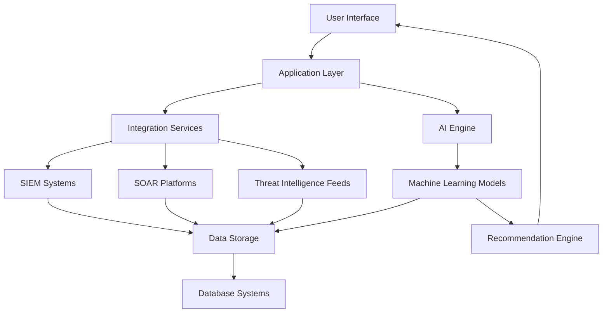

### 1.4 Assumptions and Dependencies

- **Existing Security Infrastructure**: Assumes organizations have existing security tools compatible with the platform's integration capabilities.
- **User Expertise**: Users possess a baseline level of cybersecurity knowledge to effectively interact with the platform.
- **Threat Intelligence Availability**: Continuous access to up-to-date threat intelligence feeds is available to inform AI-generated playbooks.
- **Third-Party Integrations**: Reliable APIs and support from integrated security tools such as Splunk and XSOAR are available.
- **Scalable Infrastructure**: Availability of scalable cloud or on-premises infrastructure to support the platform's performance and growth.

## 2. Process Flow

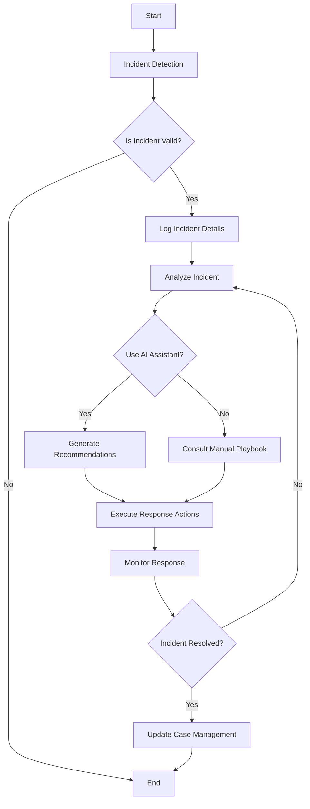

## 3. Data Flow

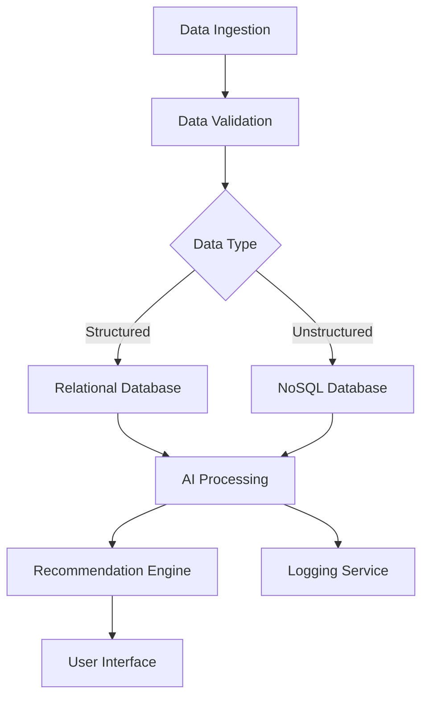

## 4. Technical Requirements

### 4.1 Incident Response Automation

#### 4.1.1 ID

TR-IR-001

#### 4.1.2 DESCRIPTION

Automate the detection, logging, analysis, and resolution of security incidents using AI-driven workflows to ensure consistent and efficient incident handling.

#### 4.1.3 PRIORITY

High

#### 4.1.4 Technical Requirements

| Requirement ID | Description                                                             | Priority |
|----------------|-------------------------------------------------------------------------|----------|
| TR-IR-001-1    | Integrate with existing SIEM systems for incident detection.            | High     |
| TR-IR-001-2    | Support automated logging of incident details into the case management system. | High     |
| TR-IR-001-3    | Enable real-time analysis of incidents using AI algorithms.             | High     |
| TR-IR-001-4    | Provide API endpoints for triggering automated response actions.        | Medium   |
| TR-IR-001-5    | Ensure scalability to handle peak incident loads without degradation.    | Medium   |

### 4.2 AI-Powered Assistance

#### 4.2.1 ID

TR-AI-002

#### 4.2.2 DESCRIPTION

Provide real-time, context-aware recommendations and interactive assistance to security analysts during incident investigations to enhance decision-making and response effectiveness.

#### 4.2.3 PRIORITY

High

#### 4.2.4 Technical Requirements

| Requirement ID | Description                                                         | Priority |
|----------------|---------------------------------------------------------------------|----------|
| TR-AI-002-1    | Implement machine learning models for generating actionable recommendations. | High     |
| TR-AI-002-2    | Ensure recommendations are updated in real-time based on incident data. | High     |
| TR-AI-002-3    | Develop a conversational interface for interactive assistance.       | Medium   |
| TR-AI-002-4    | Integrate feedback mechanisms for analysts to refine AI suggestions. | Low      |
| TR-AI-002-5    | Maintain compliance with data privacy regulations in AI operations. | High     |

### 4.3 Advanced Security Monitoring

#### 4.3.1 ID

TR-AM-003

#### 4.3.2 DESCRIPTION

Provide comprehensive, real-time monitoring of security incidents and system alerts, enabling immediate workflow adjustments and customizable alert configurations for critical events.

#### 4.3.3 PRIORITY

High

#### 4.3.4 Technical Requirements

| Requirement ID | Description                                                         | Priority |
|----------------|---------------------------------------------------------------------|----------|
| TR-AM-003-1    | Implement real-time tracking of incident response actions and alerts. | High     |
| TR-AM-003-2    | Allow configurable alert thresholds for different severity levels.   | High     |
| TR-AM-003-3    | Enable automatic workflow adjustments based on threat intelligence updates. | Medium   |
| TR-AM-003-4    | Provide integration capabilities with existing monitoring tools.     | Medium   |
| TR-AM-003-5    | Ensure high availability and reliability of monitoring services.     | High     |

### 4.4 Dynamic Playbook Generation

#### 4.4.1 ID

TR-DPG-004

#### 4.4.2 DESCRIPTION

Utilize artificial intelligence to create and modify security playbooks in real-time based on emerging threats and organizational policies, ensuring responsive and adaptive incident handling strategies.

#### 4.4.3 PRIORITY

High

#### 4.4.4 Technical Requirements

| Requirement ID | Description                                                         | Priority |
|----------------|---------------------------------------------------------------------|----------|
| TR-DPG-004-1    | Develop AI algorithms for generating standardized playbooks compatible with XSOAR. | High     |
| TR-DPG-004-2    | Incorporate real-time threat intelligence into playbook creation.   | High     |
| TR-DPG-004-3    | Validate generated playbooks against organizational policies and compliance standards. | Medium   |
| TR-DPG-004-4    | Provide interfaces for administrators to manually adjust AI-generated playbooks. | Low      |
| TR-DPG-004-5    | Ensure version control and audit logging for all playbook modifications. | Medium   |

### 4.5 Comprehensive Case Management

#### 4.5.1 ID

TR-CM-005

#### 4.5.2 DESCRIPTION

Maintain detailed logs of all incident-related activities, support comprehensive audit trails, and facilitate easy retrieval and analysis of historical data to support ongoing security operations and compliance requirements.

#### 4.5.3 PRIORITY

High

#### 4.5.4 Technical Requirements

| Requirement ID | Description                                                         | Priority |
|----------------|---------------------------------------------------------------------|----------|
| TR-CM-005-1    | Automatically log incident details, including AI-generated insights and manual actions. | High     |
| TR-CM-005-2    | Maintain audit trails linking AI recommendations with analyst decisions. | High     |
| TR-CM-005-3    | Provide search and retrieval capabilities for historical incident data. | Medium   |
| TR-CM-005-4    | Enable export of incident logs for reporting and compliance purposes. | Low      |
| TR-CM-005-5    | Integrate with external reporting tools for advanced analytics.     | Medium   |

### 4.6 User and System Management

#### 4.6.1 ID

TR-USM-006

#### 4.6.2 DESCRIPTION

Manage user roles, permissions, system configurations, and integrations to ensure operational security and efficiency within the platform.

#### 4.6.3 PRIORITY

High

#### 4.6.4 Technical Requirements

| Requirement ID | Description                                                         | Priority |
|----------------|---------------------------------------------------------------------|----------|
| TR-USM-006-1    | Implement Role-Based Access Control (RBAC) for user permissions.    | High     |
| TR-USM-006-2    | Develop user management interfaces for creating and modifying user accounts. | High     |
| TR-USM-006-3    | Provide configuration settings for system integrations with third-party tools. | Medium   |
| TR-USM-006-4    | Ensure multi-factor authentication (MFA) for all user accesses.     | High     |
| TR-USM-006-5    | Monitor and log all user and system activities for auditing purposes. | Medium   |

### 4.7 Dashboard Integration

#### 4.7.1 ID

TR-DI-007

#### 4.7.2 DESCRIPTION

Provide customizable dashboards that display key metrics, incident statuses, and performance outcomes, allowing users to tailor views according to their roles and preferences for enhanced situational awareness.

#### 4.7.3 PRIORITY

Medium

#### 4.7.4 Technical Requirements

| Requirement ID | Description                                                         | Priority |
|----------------|---------------------------------------------------------------------|----------|
| TR-DI-007-1    | Implement a high-level overview dashboard displaying all incidents and their statuses. | High     |
| TR-DI-007-2    | Display performance metrics for both automated and AI-enhanced actions. | High     |
| TR-DI-007-3    | Allow customization of dashboard views and filtering options based on user roles. | Medium   |
| TR-DI-007-4    | Enable interactive visualizations for threat trends and system performance metrics. | Low      |
| TR-DI-007-5    | Ensure real-time data updates and responsiveness of dashboard components. | Medium   |

### 4.8 Real-Time Recommendations

#### 4.8.1 ID

TR-RTR-008

#### 4.8.2 DESCRIPTION

Provide actionable, context-aware recommendations to security analysts during incident investigations, prioritizing actions based on potential impact and urgency to enhance decision-making.

#### 4.8.3 PRIORITY

High

#### 4.8.4 Technical Requirements

| Requirement ID | Description                                                         | Priority |
|----------------|---------------------------------------------------------------------|----------|
| TR-RTR-008-1    | Develop algorithms to generate actionable recommendations based on current incident context. | High     |
| TR-RTR-008-2    | Implement prioritization logic to rank recommendations by impact and urgency. | High     |
| TR-RTR-008-3    | Ensure recommendations are updated in real-time as incident data evolves. | Medium   |
| TR-RTR-008-4    | Provide feedback mechanisms for analysts to rate recommendation relevance. | Low      |
| TR-RTR-008-5    | Integrate recommendations seamlessly into the user interface for easy access. | Medium   |

### 4.9 Interactive AI Assistant

#### 4.9.1 ID

TR-IAA-009

#### 4.9.2 DESCRIPTION

Facilitate user interaction through a conversational interface, offering suggestions, resolving inquiries, and providing guidance related to security operations based on best practices and learned patterns.

#### 4.9.3 PRIORITY

Medium

#### 4.9.4 Technical Requirements

| Requirement ID | Description                                                         | Priority |
|----------------|---------------------------------------------------------------------|----------|
| TR-IAA-009-1    | Implement a natural language processing (NLP) engine for the chat interface. | High     |
| TR-IAA-009-2    | Develop context-aware suggestion algorithms based on ongoing incidents. | High     |
| TR-IAA-009-3    | Ensure clear differentiation between AI-generated responses and user inputs. | Medium   |
| TR-IAA-009-4    | Log all assistant interactions for continuous improvement and analysis. | Low      |
| TR-IAA-009-5    | Provide multi-language support for the AI assistant interface.      | Low      |

### 4.10 Integration Capabilities

#### 4.10.1 ID

TR-INT-010

#### 4.10.2 DESCRIPTION

Ensure seamless integration with existing security tools and external systems through well-documented APIs and support for custom integrations, enhancing the platform's interoperability and functionality.

#### 4.10.3 PRIORITY

High

#### 4.10.4 Technical Requirements

| Requirement ID | Description                                                         | Priority |
|----------------|---------------------------------------------------------------------|----------|
| TR-INT-010-1    | Develop RESTful APIs for communication with third-party security tools such as Splunk and XSOAR. | High     |
| TR-INT-010-2    | Support data exchange formats including JSON, XML, STIX, and TAXII. | High     |
| TR-INT-010-3    | Implement authentication mechanisms like OAuth 2.0 and API keys for secure integrations. | High     |
| TR-INT-010-4    | Provide webhook support for real-time notifications and event handling. | Medium   |
| TR-INT-010-5    | Offer comprehensive API documentation for facilitating custom integrations. | Medium   |

### 4.11 Data Management

#### 4.11.1 ID

TR-DM-011

#### 4.11.2 DESCRIPTION

Implement robust data storage, retrieval, and processing systems to ensure data integrity, availability, and compliance with retention policies across all platform components.

#### 4.11.3 PRIORITY

High

#### 4.11.4 Technical Requirements

| Requirement ID | Description                                                         | Priority |
|----------------|---------------------------------------------------------------------|----------|
| TR-DM-011-1    | Utilize a relational database (e.g., PostgreSQL) for structured data storage. | High     |
| TR-DM-011-2    | Employ a NoSQL database (e.g., MongoDB) for unstructured data storage. | High     |
| TR-DM-011-3    | Implement data encryption at rest and in transit using industry-standard protocols (e.g., AES-256, TLS 1.2+). | High     |
| TR-DM-011-4    | Ensure data redundancy and replication across multiple data centers for high availability. | High     |
| TR-DM-011-5    | Develop automated backup and recovery procedures with point-in-time recovery capabilities. | Medium   |
| TR-DM-011-6    | Enforce data retention policies adhering to regulatory requirements (e.g., GDPR, HIPAA). | High     |
| TR-DM-011-7    | Implement data integrity checks using checksums and hash verifications. | Medium   |

### 4.12 Performance Optimization

#### 4.12.1 ID

TR-PO-012

#### 4.12.2 DESCRIPTION

Optimize system performance to ensure efficient operation under expected and peak load conditions, maintaining responsiveness and minimizing resource utilization.

#### 4.12.3 PRIORITY

High

#### 4.12.4 Technical Requirements

| Requirement ID | Description                                                         | Priority |
|----------------|---------------------------------------------------------------------|----------|
| TR-PO-012-1    | Achieve average response times for AI-generated recommendations under 2 seconds. | High     |
| TR-PO-012-2    | Support at least 1000 concurrent users without performance degradation. | High     |
| TR-PO-012-3    | Optimize CPU and memory utilization to maintain system performance below 75% under peak load. | Medium   |
| TR-PO-012-4    | Implement load balancing and horizontal scaling to manage high traffic efficiently. | High     |
| TR-PO-012-5    | Conduct regular performance testing and benchmarking to identify and address bottlenecks. | Medium   |

### 4.13 Security and Compliance

#### 4.13.1 ID

TR-SC-013

#### 4.13.2 DESCRIPTION

Ensure the platform is secure against unauthorized access, data breaches, and other security threats through robust authentication, authorization, encryption, and compliance with relevant regulations.

#### 4.13.3 PRIORITY

High

#### 4.13.4 Technical Requirements

| Requirement ID | Description                                                         | Priority |
|----------------|---------------------------------------------------------------------|----------|
| TR-SC-013-1    | Implement multi-factor authentication (MFA) for all user accesses.  | High     |
| TR-SC-013-2    | Enforce Role-Based Access Control (RBAC) to restrict user permissions based on roles. | High     |
| TR-SC-013-3    | Encrypt all data at rest and in transit using industry-standard encryption protocols (e.g., AES-256, TLS 1.2+). | High     |
| TR-SC-013-4    | Conduct regular security audits and vulnerability assessments.      | Medium   |
| TR-SC-013-5    | Ensure compliance with privacy regulations such as GDPR and HIPAA.   | High     |
| TR-SC-013-6    | Implement automated monitoring and alerting for unauthorized access attempts. | High     |
| TR-SC-013-7    | Maintain comprehensive audit logs for all system activities.        | Medium   |

### 4.14 Reliability and Availability

#### 4.14.1 ID

TR-RA-014

#### 4.14.2 DESCRIPTION

Ensure the platform maintains high reliability and availability to support continuous security operations, minimizing downtime and ensuring rapid recovery from failures.

#### 4.14.3 PRIORITY

High

#### 4.14.4 Technical Requirements

| Requirement ID | Description                                                         | Priority |
|----------------|---------------------------------------------------------------------|----------|
| TR-RA-014-1    | Achieve 99.99% uptime for critical system components.               | High     |
| TR-RA-014-2    | Implement automatic failover mechanisms to maintain system availability during failures. | High     |
| TR-RA-014-3    | Develop and maintain disaster recovery plans with defined RTO and RPO. | High     |
| TR-RA-014-4    | Perform regular system health checks and automated monitoring.      | Medium   |
| TR-RA-014-5    | Ensure redundant power and network infrastructure to support high availability. | High     |
| TR-RA-014-6    | Provide seamless scalability to handle increasing data volumes and user bases without impacting availability. | High     |

### 4.15 Usability and Accessibility

#### 4.15.1 ID

TR-UA-015

#### 4.15.2 DESCRIPTION

Design the platform to be intuitive and user-friendly, ensuring accessibility for all user roles and compliance with accessibility standards to enhance user experience and productivity.

#### 4.15.3 PRIORITY

Medium

#### 4.15.4 Technical Requirements

| Requirement ID | Description                                                         | Priority |
|----------------|---------------------------------------------------------------------|----------|
| TR-UA-015-1    | Develop an intuitive and user-friendly interface tailored to different user roles. | High     |
| TR-UA-015-2    | Ensure compliance with accessibility standards (e.g., WCAG 2.1).    | Medium   |
| TR-UA-015-3    | Implement customizable dashboards with drag-and-drop widget functionality. | Medium   |
| TR-UA-015-4    | Provide comprehensive user documentation and training materials.    | Low      |
| TR-UA-015-5    | Incorporate responsive design to support various devices and screen sizes. | Medium   |

### 4.16 Maintainability and Support

#### 4.16.1 ID

TR-MS-016

#### 4.16.2 DESCRIPTION

Ensure the platform is maintainable with a modular architecture and clear documentation, supporting ongoing updates, enhancements, and efficient issue resolution.

#### 4.16.3 PRIORITY

High

#### 4.16.4 Technical Requirements

| Requirement ID | Description                                                         | Priority |
|----------------|---------------------------------------------------------------------|----------|
| TR-MS-016-1    | Design a modular architecture to facilitate ease of maintenance and scalability. | High     |
| TR-MS-016-2    | Provide comprehensive and clear documentation for all system components and APIs. | High     |
| TR-MS-016-3    | Implement automated testing and continuous integration pipelines to support ongoing development and deployment. | Medium   |
| TR-MS-016-4    | Establish a dedicated support team for handling user inquiries and technical issues. | Medium   |
| TR-MS-016-5    | Enable remote monitoring and diagnostics for proactive issue detection and resolution. | Low      |

### 4.17 Scalability

#### 4.17.1 ID

TR-SC-017

#### 4.17.2 DESCRIPTION

Design the platform to scale horizontally and vertically to accommodate growing data volumes, user bases, and increasing complexity of security operations without compromising performance.

#### 4.17.3 PRIORITY

High

#### 4.17.4 Technical Requirements

| Requirement ID | Description                                                         | Priority |
|----------------|---------------------------------------------------------------------|----------|
| TR-SC-017-1    | Implement load balancing to distribute workloads efficiently across servers. | High     |
| TR-SC-017-2    | Utilize containerization and orchestration tools (e.g., Docker, Kubernetes) to manage scalable deployments. | High     |
| TR-SC-017-3    | Design the database architecture to support horizontal scaling and sharding. | High     |
| TR-SC-017-4    | Ensure that all services are stateless to facilitate easy scaling. | Medium   |
| TR-SC-017-5    | Implement auto-scaling policies based on real-time usage metrics and system load. | Medium   |
| TR-SC-017-6    | Optimize resource utilization to support cost-effective scaling.    | Medium   |

### 4.18 Interoperability

#### 4.18.1 ID

TR-INT-018

#### 4.18.2 DESCRIPTION

Ensure the platform can operate seamlessly with a wide range of external systems and tools, supporting diverse environments and enhancing overall functionality.

#### 4.18.3 PRIORITY

Medium

#### 4.18.4 Technical Requirements

| Requirement ID | Description                                                         | Priority |
|----------------|---------------------------------------------------------------------|----------|
| TR-INT-018-1    | Support integration with major SIEM and SOAR platforms through standardized APIs. | High     |
| TR-INT-018-2    | Ensure compatibility with various operating systems and cloud environments. | Medium   |
| TR-INT-018-3    | Provide SDKs and libraries for facilitating custom integrations by third-party developers. | Medium   |
| TR-INT-018-4    | Implement middleware solutions to bridge compatibility gaps between disparate systems. | Low      |
| TR-INT-018-5    | Maintain thorough documentation for all supported integrations and interoperability features. | Medium   |

### 4.19 Data Privacy

#### 4.19.1 ID

TR-DP-019

#### 4.19.2 DESCRIPTION

Protect sensitive data through robust privacy measures, ensuring compliance with data protection regulations and safeguarding user and organizational information.

#### 4.19.3 PRIORITY

High

#### 4.19.4 Technical Requirements

| Requirement ID | Description                                                         | Priority |
|----------------|---------------------------------------------------------------------|----------|
| TR-DP-019-1    | Implement data anonymization techniques for sensitive information.   | High     |
| TR-DP-019-2    | Ensure compliance with GDPR, HIPAA, and other relevant data protection regulations. | High     |
| TR-DP-019-3    | Develop data access policies to restrict access to sensitive data based on user roles. | High     |
| TR-DP-019-4    | Conduct regular privacy impact assessments to identify and mitigate data privacy risks. | Medium   |
| TR-DP-019-5    | Provide mechanisms for data subjects to exercise their rights (e.g., data access, deletion). | Medium   |
| TR-DP-019-6    | Maintain secure data storage solutions with encryption and access controls. | High     |

### 4.20 Logging and Monitoring

#### 4.20.1 ID

TR-LM-020

#### 4.20.2 DESCRIPTION

Implement comprehensive logging and monitoring systems to track all platform activities, ensuring accountability, facilitating troubleshooting, and supporting security incident investigations.

#### 4.20.3 PRIORITY

High

#### 4.20.4 Technical Requirements

| Requirement ID | Description                                                         | Priority |
|----------------|---------------------------------------------------------------------|----------|
| TR-LM-020-1    | Implement centralized logging for all system and user activities.   | High     |
| TR-LM-020-2    | Ensure logs are tamper-proof and securely stored.                   | High     |
| TR-LM-020-3    | Provide real-time monitoring dashboards for system performance and security events. | High     |
| TR-LM-020-4    | Enable automated alerts for suspicious activities and system anomalies. | High     |
| TR-LM-020-5    | Facilitate log analysis and reporting through integration with SIEM tools. | Medium   |
| TR-LM-020-6    | Maintain log retention policies in compliance with regulatory requirements. | High     |

### 4.21 API Management

#### 4.21.1 ID

TR-API-021

#### 4.21.2 DESCRIPTION

Manage APIs effectively to ensure secure, reliable, and scalable interactions between the platform and external systems, supporting both internal and third-party integrations.

#### 4.21.3 PRIORITY

Medium

#### 4.21.4 Technical Requirements

| Requirement ID  | Description                                                         | Priority |
|-----------------|---------------------------------------------------------------------|----------|
| TR-API-021-1    | Develop and maintain comprehensive API documentation.               | High     |
| TR-API-021-2    | Implement rate limiting and throttling to prevent API abuse.        | Medium   |
| TR-API-021-3    | Ensure APIs are versioned to support backward compatibility.        | High     |
| TR-API-021-4    | Secure APIs with authentication mechanisms such as OAuth 2.0 and API keys. | High     |
| TR-API-021-5    | Provide SDKs and client libraries for popular programming languages to facilitate API usage. | Medium   |
| TR-API-021-6    | Monitor API performance and usage metrics for optimization and troubleshooting. | Medium   |

### 4.22 Data Analytics and Reporting

#### 4.22.1 ID

TR-DA-022

#### 4.22.2 DESCRIPTION

Provide robust data analytics and reporting capabilities to enable security teams to gain insights from incident data, track performance metrics, and generate compliance reports.

#### 4.22.3 PRIORITY

Medium

#### 4.22.4 Technical Requirements

| Requirement ID | Description                                                         | Priority |
|----------------|---------------------------------------------------------------------|----------|
| TR-DA-022-1    | Implement advanced analytics tools for incident trend analysis.    | High     |
| TR-DA-022-2    | Develop customizable reporting templates for various use cases.     | High     |
| TR-DA-022-3    | Ensure real-time data processing for up-to-date analytics.          | Medium   |
| TR-DA-022-4    | Provide data visualization tools for intuitive insight generation.  | Medium   |
| TR-DA-022-5    | Enable automated report scheduling and distribution to stakeholders. | Low      |
| TR-DA-022-6    | Integrate with external business intelligence (BI) platforms for enhanced reporting capabilities. | Medium   |

### 4.23 Continuous Improvement

#### 4.23.1 ID

TR-CI-023

#### 4.23.2 DESCRIPTION

Foster a culture of continuous improvement by implementing mechanisms for regular feedback, system updates, and iterative enhancements to the platform based on user experiences and evolving security threats.

#### 4.23.3 PRIORITY

Low

#### 4.23.4 Technical Requirements

| Requirement ID | Description                                                         | Priority |
|----------------|---------------------------------------------------------------------|----------|
| TR-CI-023-1    | Establish feedback channels for users to report issues and suggest improvements. | Medium   |
| TR-CI-023-2    | Implement a continuous integration/continuous deployment (CI/CD) pipeline for seamless updates. | High     |
| TR-CI-023-3    | Conduct regular user satisfaction surveys to identify areas for enhancement. | Low      |
| TR-CI-023-4    | Monitor emerging security threats and update AI models and playbooks accordingly. | High     |
| TR-CI-023-5    | Maintain a roadmap for planned feature additions and system upgrades. | Medium   |
| TR-CI-023-6    | Facilitate regular training sessions and webinars for users to stay updated on new features and best practices. | Low      |

### 4.24 Localization and Internationalization

#### 4.24.1 ID

TR-LI-024

#### 4.24.2 DESCRIPTION

Support multiple languages and regional settings to cater to a global user base, ensuring the platform is accessible and usable across different geographic locations.

#### 4.24.3 PRIORITY

Low

#### 4.24.4 Technical Requirements

| Requirement ID | Description                                                         | Priority |
|----------------|---------------------------------------------------------------------|----------|
| TR-LI-024-1    | Implement internationalization (i18n) frameworks to support multiple languages. | Medium   |
| TR-LI-024-2    | Provide localization (l10n) for user interfaces, documentation, and support materials. | Medium   |
| TR-LI-024-3    | Ensure date, time, and currency formats adapt to regional settings. | Low      |
| TR-LI-024-4    | Facilitate easy addition of new languages through modular language packs. | Low      |
| TR-LI-024-5    | Conduct usability testing with users from different regions to ensure accessibility and effectiveness. | Low      |
| TR-LI-024-6    | Maintain language-specific support and troubleshooting resources. | Low      |

---

## 1.3 System Architecture

```mermaid
graph TD
    subgraph User Layer
        A[User Interface]
    end

    subgraph Application Layer
        B[API Gateway]
        C[Authentication Service]
        D[Authorization Service]
        E[Incident Management Service]
        F[Playbook Engine]
        G[AI Recommendation Engine]
        H[Notification Service]
    end

    subgraph Integration Layer
        I[SIEM Systems]
        J[SOAR Platforms]
        K[Threat Intelligence Feeds]
        L[External Reporting Tools]
    end

    subgraph Data Layer
        M[Relational Database (PostgreSQL)]
        N[NoSQL Database (MongoDB)]
        O[Data Lake]
    end

    A --> B
    B --> C
    B --> D
    B --> E
    E --> F
    E --> G
    E --> H
    E --> I
    E --> J
    E --> K
    F --> M
    G --> N
    H --> L
    I --> M
    J --> M
    K --> O
    L --> M
```

### 1.3.1 Components

#### User Interface
Provides the frontend through which users interact with the platform. It includes dashboards, incident management interfaces, and the AI assistant interface.

#### API Gateway
Acts as the entry point for all client requests, routing them to appropriate services within the application layer.

#### Authentication Service
Handles user authentication, ensuring that only authorized users can access the platform.

#### Authorization Service
Manages user permissions and roles, enforcing access control policies based on RBAC.

#### Incident Management Service
Automates incident detection, logging, analysis, and resolution by interfacing with SIEM and SOAR systems.

#### Playbook Engine
Generates and executes AI-driven playbooks for automated incident response workflows.

#### AI Recommendation Engine
Provides real-time, context-aware recommendations to security analysts based on incident data and threat intelligence.

#### Notification Service
Handles the distribution of alerts, notifications, and reports to relevant stakeholders.

#### SIEM Systems
Integrates with Security Information and Event Management systems like Splunk to ingest and analyze security events.

#### SOAR Platforms
Connects with Security Orchestration, Automation, and Response platforms such as XSOAR to execute playbooks and automate responses.

#### Threat Intelligence Feeds
Consumes real-time threat intelligence data from external providers to inform AI-generated playbooks and recommendations.

#### External Reporting Tools
Interfaces with reporting and business intelligence tools for advanced data analytics and visualization.

#### Relational Database (PostgreSQL)
Stores structured data such as user information, incident logs, and playbook configurations.

#### NoSQL Database (MongoDB)
Handles unstructured data, including logs, AI-generated insights, and threat intelligence data.

#### Data Lake
Serves as a repository for raw data collected from various sources, facilitating batch processing and historical analysis.

### 1.3.2 Interactions

- **User Interface ↔ API Gateway**: Users interact with the platform through the UI, which communicates with backend services via the API Gateway.
- **API Gateway ↔ Authentication & Authorization Services**: Ensures secure access by validating user credentials and permissions.
- **Incident Management Service ↔ SIEM/SOAR Platforms**: Receives security events from SIEM systems and orchestrates responses through SOAR platforms.
- **Playbook Engine ↔ Relational Database**: Retrieves and stores playbook configurations and execution logs.
- **AI Recommendation Engine ↔ NoSQL Database**: Accesses unstructured data to generate context-aware recommendations.
- **Threat Intelligence Feeds ↔ Data Lake**: Ingests external threat data for analysis and integration into AI processes.
- **Notification Service ↔ External Reporting Tools**: Sends alerts and reports to stakeholders for informed decision-making.

### 1.3.3 Technology Stack

| Layer            | Component                   | Technology                          |
|------------------|-----------------------------|-------------------------------------|
| **User Layer**   | User Interface              | React.js, Redux                     |
| **Application Layer** | API Gateway               | Kong, NGINX                         |
|                    | Authentication Service     | OAuth 2.0, JWT                      |
|                    | Authorization Service      | RBAC-based system                   |
|                    | Incident Management Service | Node.js, Express.js                 |
|                    | Playbook Engine            | Python, AI/ML libraries (TensorFlow)|
|                    | AI Recommendation Engine   | Python, Scikit-learn, TensorFlow     |
|                    | Notification Service       | RabbitMQ, Redis                      |
| **Integration Layer** | SIEM Systems               | Splunk                               |
|                    | SOAR Platforms             | XSOAR                                |
|                    | Threat Intelligence Feeds  | STIX, TAXII                          |
|                    | External Reporting Tools   | Tableau, Power BI                    |
| **Data Layer**    | Relational Database        | PostgreSQL                           |
|                    | NoSQL Database             | MongoDB                              |
|                    | Data Lake                  | AWS S3, Hadoop                       |

---

## 2. System Components

### 2.1 Component Diagrams

```mermaid
graph TD
    subgraph User Layer
        UI[User Interface]
    end

    subgraph Application Layer
        APIGW[API Gateway]
        AuthSvc[Authentication Service]
        AuthzSvc[Authorization Service]
        IncMgmt[Incident Management Service]
        PlaybookEng[Playbook Engine]
        AIEngine[AI Recommendation Engine]
        NotifySvc[Notification Service]
    end

    subgraph Integration Layer
        SIEM[SIEM Systems]
        SOAR[SOAR Platforms]
        ThreatINT[Threat Intelligence Feeds]
        Reporting[External Reporting Tools]
    end

    subgraph Data Layer
        RelDB[Relational Database (PostgreSQL)]
        NoSQLDB[NoSQL Database (MongoDB)]
        DataLake[Data Lake]
    end

    UI --> APIGW
    APIGW --> AuthSvc
    APIGW --> AuthzSvc
    APIGW --> IncMgmt
    IncMgmt --> PlaybookEng
    IncMgmt --> AIEngine
    IncMgmt --> NotifySvc
    IncMgmt --> SIEM
    IncMgmt --> SOAR
    IncMgmt --> ThreatINT
    PlaybookEng --> RelDB
    AIEngine --> NoSQLDB
    NotifySvc --> Reporting
    SIEM --> RelDB
    SOAR --> RelDB
    ThreatINT --> DataLake
    Reporting --> RelDB
```

### 2.2 Sequence Diagrams

#### 2.2.1 Incident Detection and Response

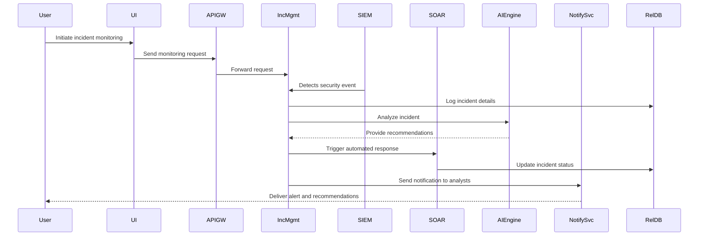

#### 2.2.2 Playbook Generation and Execution

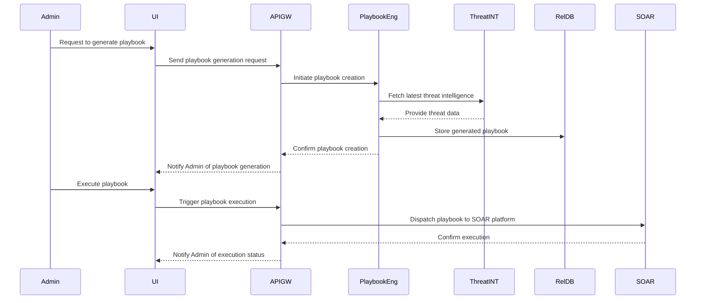

#### 2.2.3 AI Recommendation Generation

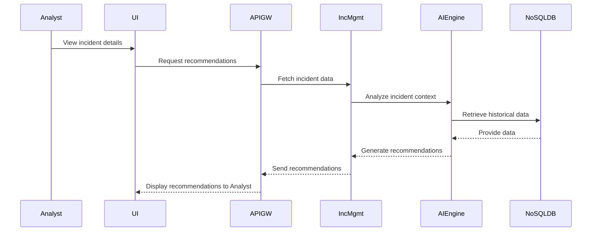

### 2.3 Data-Flow Diagram


#### Detailed Data Flow Explanation

1. **Data Ingestion**: Data from integrated security tools (e.g., SIEM systems) and external threat intelligence feeds are ingested via secure APIs.
2. **Data Validation**: Incoming data is validated for accuracy, completeness, and integrity to ensure it meets predefined criteria.
3. **Data Storage**:
    - **Structured Data**: Stored in the Relational Database (PostgreSQL) for easy querying and consistency.
    - **Unstructured Data**: Stored in the NoSQL Database (MongoDB) to accommodate flexible data schemas.
4. **AI Processing**: Machine learning models analyze the validated data to identify patterns, detect anomalies, and generate insights.
5. **Recommendation Engine**: Utilizes AI-generated insights to formulate actionable recommendations for security analysts.
6. **User Interface**: Displays processed data and recommendations through intuitive dashboards and interfaces, allowing users to interact with and act upon the information.
7. **Logging Service**: Logs all data processing activities for auditing, compliance, and continuous improvement purposes.

---

## 4. System Design

### 4.1 Programming Languages

| **Component**               | **Programming Language** | **Justification**                                                                                   |
|-----------------------------|--------------------------|------------------------------------------------------------------------------------------------------|
| **User Interface**          | JavaScript (React.js)    | Provides a dynamic and responsive frontend experience with a robust ecosystem and community support. |
| **State Management**        | JavaScript (Redux)       | Enables predictable state management and facilitates debugging for complex UI interactions.         |
| **API Gateway**             | JavaScript (Node.js)     | Lightweight and efficient for handling concurrent requests with a large number of APIs.            |
| **Authentication Service**  | JavaScript (Node.js)     | Seamlessly integrates with the API Gateway using JavaScript-based frameworks.                       |
| **Authorization Service**   | JavaScript (Node.js)     | Consistent language usage across services simplifies maintenance and integration.                   |
| **Incident Management Service** | JavaScript (Node.js) | Facilitates real-time incident processing and quick response times.                                 |
| **Playbook Engine**         | Python                   | Leverages AI/ML libraries like TensorFlow for dynamic playbook generation and execution.            |
| **AI Recommendation Engine**| Python                   | Utilizes machine learning models and libraries such as Scikit-learn and TensorFlow for recommendations.|
| **Notification Service**    | Python, JavaScript       | Combines Python for backend processing and JavaScript (Node.js) for real-time notifications.       |
| **Integration Services**    | Python, JavaScript       | Python for data processing and JavaScript for API integrations ensure flexibility and scalability.  |
| **Relational Database**     | SQL                      | Structured query language for managing structured data in PostgreSQL.                              |
| **NoSQL Database**          | JavaScript (Node.js)     | Efficient handling of unstructured data in MongoDB.                                                |
| **Data Lake**               | Python, JavaScript       | Python for data ingestion and processing; JavaScript for interfacing with AWS S3 and Hadoop.      |

### 4.2 Database Design

#### 4.2.1 Data Model

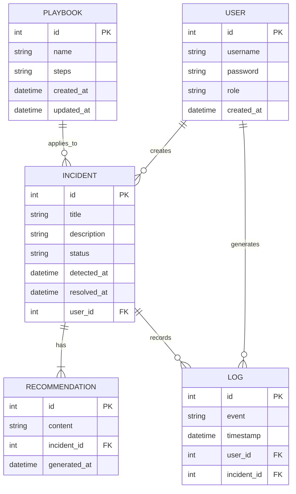

#### 4.2.2 Database Systems

| **Database**          | **Type**          | **Purpose**                                                                                |
|-----------------------|-------------------|--------------------------------------------------------------------------------------------|
| **PostgreSQL**        | Relational (SQL)  | Stores structured data such as user information, incident logs, and playbook configurations.|
| **MongoDB**           | NoSQL             | Handles unstructured data including logs, AI-generated insights, and threat intelligence.    |
| **AWS S3**            | Data Lake         | Serves as a repository for raw data collected from various sources, facilitating batch processing and historical analysis. |

#### 4.2.3 Data Storage Strategy

| **Aspect**            | **Details**                                                                                              |
|-----------------------|----------------------------------------------------------------------------------------------------------|
| **Data Retention**    | - **Incidents**: Retained for 7 years.<br>- **Logs**: Stored for 5 years.<br>- **Playbooks**: Retained indefinitely with versioning. |
| **Redundancy**        | - Data replicated across multiple data centers.<br>- Database clustering and failover mechanisms implemented. |
| **Backup**            | - Daily incremental backups.<br>- Weekly full backups.<br>- Encrypted backups stored in geographically separated locations. |
| **Recovery**          | - Point-in-time recovery capabilities for databases.<br>- Automated backup restoration testing.           |

### 4.3 API Design

#### 4.3.1 API Overview

| **API Name**            | **Description**                                                     | **Authentication** |
|-------------------------|---------------------------------------------------------------------|---------------------|
| **User Management API** | Handles user creation, modification, and role assignments.         | OAuth 2.0, JWT      |
| **Incident API**        | Manages incident detection, logging, and status updates.           | OAuth 2.0, API Keys  |
| **Playbook API**        | Facilitates playbook generation, execution, and retrieval.         | OAuth 2.0, API Keys  |
| **Recommendation API**  | Provides AI-generated recommendations for incidents.               | OAuth 2.0, JWT      |
| **Notification API**    | Manages sending notifications and alerts to users.                 | API Keys            |
| **Integration API**     | Enables communication with third-party security tools like Splunk and XSOAR. | OAuth 2.0, API Keys  |

#### 4.3.2 API Endpoint Structure

```mermaid
graph LR
    subgraph User Management API
        UM1[POST /users] --> UM2[GET /users/{id}]
        UM3[PUT /users/{id}] --> UM4[DELETE /users/{id}]
    end
    subgraph Incident API
        IC1[POST /incidents] --> IC2[GET /incidents/{id}]
        IC3[PUT /incidents/{id}] --> IC4[DELETE /incidents/{id}]
    end
    subgraph Playbook API
        PB1[POST /playbooks] --> PB2[GET /playbooks/{id}]
        PB3[PUT /playbooks/{id}] --> PB4[DELETE /playbooks/{id}]
    end
    subgraph Recommendation API
        RC1[GET /recommendations/{incident_id}]
    end
    subgraph Notification API
        NT1[POST /notifications] --> NT2[GET /notifications/{id}]
    end
    subgraph Integration API
        IN1[POST /integrations/splunk] --> IN2[POST /integrations/xsoar]
    end
```

#### 4.3.3 API Specifications

| **Endpoint**               | **Method** | **Description**                                 | **Request Body**           | **Response**            |
|----------------------------|------------|-------------------------------------------------|----------------------------|-------------------------|
| `/users`                   | POST       | Create a new user                               | `{username, password, role}` | `{user_id, status}`    |
| `/users/{id}`              | GET        | Retrieve user details                           | N/A                        | `{id, username, role}`  |
| `/users/{id}`              | PUT        | Update user information                         | `{username, password, role}` | `{status}`             |
| `/users/{id}`              | DELETE     | Delete a user                                   | N/A                        | `{status}`             |
| `/incidents`               | POST       | Log a new incident                              | `{title, description, detected_at}` | `{incident_id, status}`|
| `/incidents/{id}`          | GET        | Retrieve incident details                       | N/A                        | `{id, title, description, status}` |
| `/incidents/{id}`          | PUT        | Update incident status                          | `{status}`                 | `{status}`             |
| `/incidents/{id}`          | DELETE     | Delete an incident                              | N/A                        | `{status}`             |
| `/playbooks`               | POST       | Generate a new playbook                         | `{name, steps}`            | `{playbook_id, status}`|
| `/playbooks/{id}`          | GET        | Retrieve playbook details                       | N/A                        | `{id, name, steps}`    |
| `/playbooks/{id}`          | PUT        | Update playbook                                 | `{name, steps}`            | `{status}`             |
| `/playbooks/{id}`          | DELETE     | Delete a playbook                               | N/A                        | `{status}`             |
| `/recommendations/{incident_id}` | GET  | Get recommendations for an incident             | N/A                        | `{recommendations}`    |
| `/notifications`           | POST       | Send a notification                             | `{user_id, message}`       | `{notification_id, status}`|
| `/notifications/{id}`      | GET        | Retrieve notification status                    | N/A                        | `{id, status}`         |
| `/integrations/splunk`     | POST       | Integrate with Splunk                            | `{config_details}`         | `{status}`             |
| `/integrations/xsoar`      | POST       | Integrate with XSOAR                             | `{config_details}`         | `{status}`             |

#### 4.3.4 API Authentication and Security

| **Authentication Mechanism** | **Description**                                                         |
|-------------------------------|-------------------------------------------------------------------------|
| **OAuth 2.0**                 | Provides secure authorization for API access with token-based authentication. |
| **JWT (JSON Web Tokens)**     | Ensures stateless and secure transmission of user identity and claims.  |
| **API Keys**                  | Simple authentication method for integrating with third-party services and internal APIs. |
| **TLS 1.2+**                  | Encrypts all data in transit to prevent interception and tampering.      |

#### 4.3.5 API Rate Limiting

| **Endpoint Category** | **Rate Limit**           | **Description**                                        |
|-----------------------|--------------------------|--------------------------------------------------------|
| **User Management**   | 100 requests per minute  | Prevents abuse and ensures fair usage of user APIs.    |
| **Incident API**      | 200 requests per minute  | Handles high load during peak incident reporting times.|
| **Playbook API**      | 150 requests per minute  | Manages playbook generation and execution efficiently. |
| **Recommendation API**| 300 requests per minute  | Supports real-time recommendation generation demands.  |
| **Notification API**  | 500 requests per minute  | Accommodates high-frequency notifications and alerts.  |
| **Integration API**   | 250 requests per minute  | Ensures smooth integration with external tools like Splunk and XSOAR. |

### 4.4 Diagrammatic Representations

#### 4.4.1 API Interaction Diagram

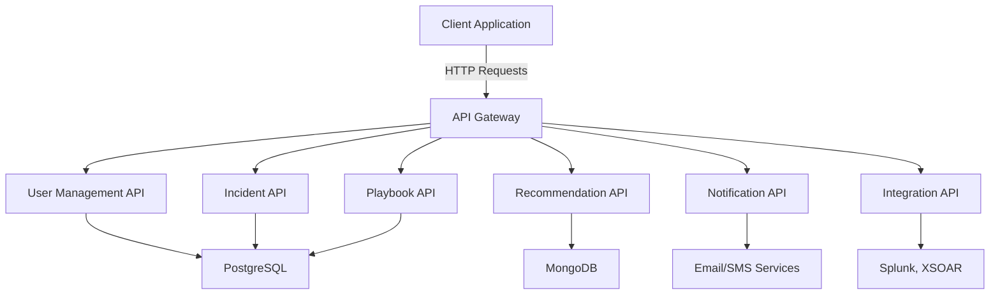

#### 4.4.2 Sequence Diagram for API Call

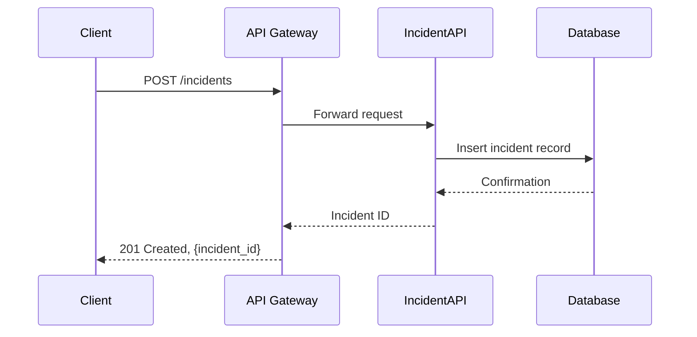

## USER INTERFACE DESIGN

### 4.1 Dashboard

#### 4.1.1 Layout

The Dashboard serves as the central hub for users to monitor and manage security incidents. It features a clean and intuitive layout divided into several key sections:

- **Header**: Contains the platform logo, user profile access, and global navigation links.
- **Sidebar**: Provides quick access to different modules such as Incidents, Playbooks, Recommendations, and Settings.
- **Main Panel**:
  - **Overview Widgets**: Display high-level metrics like total incidents, resolved incidents, active threats, and system health status.
  - **Incident Timeline**: Visual representation of incident occurrences over time, allowing users to identify trends and spikes.
  - **Recent Activities**: Lists the most recent actions taken by analysts and automated systems.
  - **Threat Map**: Geographical visualization of active threats, highlighting regions with the highest activity.

#### 4.1.2 Functionality

- **Real-Time Updates**: Automatically refreshes data to provide up-to-date information on security incidents and system performance.
- **Customizable Widgets**: Users can add, remove, or rearrange widgets based on their preferences and roles.
- **Interactive Charts**: Allows users to drill down into specific metrics for detailed analysis.
- **Alert Notifications**: Displays real-time alerts for critical incidents directly on the dashboard for immediate attention.
- **Export Capabilities**: Users can export dashboard data and visualizations for reporting and further analysis.

#### 4.1.3 Wireframe Mockup


### 4.2 Incident Management Interface

#### 4.2.1 Layout

The Incident Management Interface is designed to facilitate efficient handling of security incidents through a structured and user-friendly layout:

- **Search Bar**: Enables quick searching and filtering of incidents based on various criteria such as severity, status, and date.
- **Incident List**: Displays a table of all incidents with columns for ID, Title, Status, Severity, Detected At, and Actions.
- **Detail Pane**: Upon selecting an incident, a detailed view appears on the right side, showing comprehensive information including descriptions, affected systems, and related playbooks.
- **Action Buttons**: Provides options to update status, assign analysts, escalate incidents, and trigger automated responses.
- **Timeline View**: Chronicles all actions and decisions made during the incident lifecycle, ensuring a transparent audit trail.

#### 4.2.2 Functionality

- **Incident Tracking**: Allows users to monitor the progress of each incident from detection to resolution.
- **Playbook Integration**: Facilitates the execution and management of playbooks directly within the incident view.
- **Collaboration Tools**: Enables multiple analysts to collaborate on the same incident, share notes, and assign tasks.
- **Automated Actions**: Integrates with SOAR platforms to trigger automated responses based on predefined or AI-generated playbooks.
- **Historical Data Access**: Provides access to historical incidents for analysis and learning purposes.

#### 4.2.3 Wireframe Mockup


### 4.3 AI Assistant Interface

#### 4.3.1 Layout

The AI Assistant Interface offers a conversational interface integrated into the platform, designed to assist analysts with real-time guidance and recommendations:

- **Chat Window**: Positioned at the bottom right corner of the screen, accessible from all main interfaces.
- **Input Field**: Allows users to type queries or commands to interact with the AI assistant.
- **Response Area**: Displays AI-generated responses, suggestions, and actionable insights.
- **Contextual Indicators**: Highlights relevant information and differentiates between AI responses and user inputs through distinct color schemes or avatars.
- **History Log**: Maintains a log of past interactions for reference and continuity in ongoing incidents.

#### 4.3.2 Functionality

- **Natural Language Understanding**: Enables users to communicate with the AI assistant using plain language for ease of use.
- **Context-Aware Responses**: Provides recommendations and information based on the current context of the incident being handled.
- **Actionable Insights**: Suggests next steps, mitigation actions, and relevant playbooks to resolve incidents effectively.
- **Knowledge Base Integration**: Accesses a comprehensive knowledge base to answer specific security-related inquiries and best practices.
- **Multi-Language Support**: Facilitates interactions in multiple languages to cater to a diverse user base.

#### 4.3.3 Wireframe Mockup


### 4.4 User Roles and Permissions Interface

#### 4.4.1 Layout

The User Roles and Permissions Interface provides administrators with tools to manage user access and roles within the platform:

- **User List**: Displays all registered users with details such as Username, Role, Last Login, and Status.
- **Role Management Panel**: Allows administrators to create, modify, and assign roles with specific permissions.
- **Permission Matrix**: Visual grid that maps roles to their respective permissions across different modules and actions.
- **Search and Filter**: Enables sorting and filtering of users based on roles, permissions, and activity status.
- **Audit Logs**: Records all changes made to user roles and permissions for compliance and auditing purposes.

#### 4.4.2 Functionality

- **Role Creation and Assignment**: Administrators can define new roles and assign them to users based on job functions.
- **Permission Customization**: Fine-grained control over what each role can view, create, edit, or delete within the platform.
- **Bulk Operations**: Facilitates bulk assignment or modification of roles and permissions to streamline administrative tasks.
- **Access Reviews**: Provides tools for periodic review and validation of user permissions to maintain security integrity.
- **Integration with Authentication Services**: Syncs with authentication mechanisms to ensure seamless enforcement of access controls.

#### 4.4.3 Wireframe Mockup


### 4.5 Notification and Alert Interface

#### 4.5.1 Layout

The Notification and Alert Interface ensures that users are promptly informed about critical events and updates:

- **Notification Panel**: Accessible from the header, displays a list of recent notifications with timestamps and severity indicators.
- **Alert Banner**: Prominently positioned at the top of the interface for high-severity alerts requiring immediate action.
- **Settings Icon**: Allows users to configure their notification preferences, including channels (email, SMS, in-app) and alert thresholds.
- **Read/Unread Indicators**: Visually distinguishes between new and previously viewed notifications to help users prioritize their responses.
- **Action Buttons**: Provides quick actions such as dismissing alerts, marking as read, or escalating issues directly from the notification.

#### 4.5.2 Functionality

- **Real-Time Alerts**: Delivers instant notifications for critical incidents and system events to ensure timely responses.
- **Multi-Channel Notifications**: Supports delivery of alerts through various channels like email, SMS, and in-app messages based on user preferences.
- **Customizable Thresholds**: Users can define the severity levels and types of events that trigger specific notifications.
- **Escalation Policies**: Automatically escalates unresolved alerts to higher-level analysts or administrators after predefined time intervals.
- **Notification History**: Maintains a log of all past notifications for reference and auditing purposes.

#### 4.5.3 Wireframe Mockup


### 4.6 Reporting and Analytics Interface

#### 4.6.1 Layout

The Reporting and Analytics Interface provides comprehensive tools for generating, viewing, and exporting reports:

- **Report Selection Menu**: Lists available report types such as Incident Summary, Threat Trends, Response Effectiveness, and Compliance Reports.
- **Filter and Parameter Options**: Allows users to customize reports by selecting date ranges, severity levels, departments, and other relevant parameters.
- **Report Preview Area**: Displays a preview of the generated report with key metrics and visualizations before exporting.
- **Export Options**: Facilitates exporting reports in various formats such as PDF, Excel, and CSV for sharing and further analysis.
- **Scheduled Reporting**: Enables users to set up automated report generation and distribution at regular intervals.

#### 4.6.2 Functionality

- **Advanced Data Visualization**: Incorporates charts, graphs, and heatmaps to provide intuitive insights into security data.
- **Custom Report Templates**: Users can create and save custom report templates tailored to specific needs and preferences.
- **Interactive Dashboards**: Offers drill-down capabilities within reports for detailed examination of specific metrics.
- **Compliance Tracking**: Generates reports that demonstrate adherence to regulatory requirements and internal policies.
- **Integration with BI Tools**: Supports integration with external Business Intelligence platforms like Tableau and Power BI for enhanced analytics capabilities.

#### 4.6.3 Wireframe Mockup


### 4.7 Settings and Configuration Interface

#### 4.7.1 Layout

The Settings and Configuration Interface allows administrators to customize and manage the platform's operational parameters:

- **General Settings**: Options for configuring basic platform settings such as language preferences, time zones, and theme selection.
- **Integration Settings**: Manages connections with external systems like SIEMs, SOAR platforms, and threat intelligence feeds.
- **AI Configuration**: Provides controls for managing AI model parameters, retraining schedules, and feedback mechanisms.
- **User Management**: Links to the User Roles and Permissions Interface for managing user access and roles.
- **System Monitoring**: Displays system health metrics, performance indicators, and logs for ongoing maintenance.
- **Backup and Recovery**: Tools for managing data backups, restoring from backups, and configuring disaster recovery plans.

#### 4.7.2 Functionality

- **Customizable Preferences**: Allows users to personalize their experience by adjusting settings to their liking.
- **API Key Management**: Facilitates the creation, rotation, and deletion of API keys for secure integrations.
- **AI Model Updates**: Enables administrators to update, retrain, or replace AI models as needed to maintain effectiveness.
- **System Alerts Configuration**: Defines the criteria and actions for various system alerts and notifications.
- **Backup Scheduling**: Automates regular data backups and provides options for manual backups when necessary.
- **Access Logs**: Provides detailed logs of system access and configuration changes for auditing purposes.

#### 4.7.3 Wireframe Mockup


### 4.8 Help and Support Interface

#### 4.8.1 Layout

The Help and Support Interface provides users with access to documentation, support resources, and contact options:

- **Help Center**: Central repository for user manuals, FAQs, and best practice guides.
- **Search Bar**: Allows users to quickly find relevant help topics and articles.
- **Tutorials and Videos**: Interactive tutorials and instructional videos to guide users through various platform features.
- **Support Ticket System**: Interface for submitting and tracking support tickets for technical assistance.
- **Live Chat**: Real-time chat feature for immediate support from the help desk.
- **Feedback Form**: Enables users to submit feedback, suggestions, and report issues directly to the development team.

#### 4.8.2 Functionality

- **Comprehensive Documentation**: Provides detailed guides and references to help users effectively utilize the platform.
- **Interactive Tutorials**: Step-by-step tutorials to onboard new users and train them on advanced features.
- **Responsive Support**: Ensures timely responses to user-submitted support tickets and live chat inquiries.
- **Feedback Collection**: Gathers user feedback to inform continuous improvement and feature enhancements.
- **Knowledge Base Updates**: Continuously updates the knowledge base with new information, resolved issues, and user-contributed content.

#### 4.8.3 Wireframe Mockup


### 4.9 Mobile Interface Design

#### 4.9.1 Layout

The Mobile Interface Design ensures that users can access critical platform functionalities on-the-go through a responsive and optimized mobile layout:

- **Navigation Menu**: Simplified menu with essential navigation links such as Dashboard, Incidents, Notifications, and Settings.
- **Quick Actions**: Easily accessible buttons for common actions like logging new incidents, viewing alerts, and accessing recommendations.
- **Compact Widgets**: Condensed versions of dashboard widgets displaying key metrics and critical alerts.
- **Incident Overview**: Mobile-optimized view of incident details with expandable sections for descriptions, actions, and recommendations.
- **AI Assistant Chat**: Integrated chat interface for interacting with the AI assistant directly from the mobile device.

#### 4.9.2 Functionality

- **Responsive Design**: Adapts seamlessly to various screen sizes and orientations to provide a consistent user experience.
- **Push Notifications**: Delivers real-time alerts and updates to mobile devices to ensure immediate awareness of critical events.
- **Touch-Friendly Controls**: Optimized for touch interactions, enabling easy navigation and action execution on mobile devices.
- **Offline Access**: Provides limited offline functionality, allowing users to view cached data and perform certain actions without an active internet connection.
- **Secure Authentication**: Implements secure login mechanisms, including biometric authentication (e.g., fingerprint, facial recognition) for enhanced security on mobile devices.

#### 4.9.3 Wireframe Mockup


### 4.10 Accessibility Features

#### 4.10.1 Layout

The Accessibility Features ensure that the platform is usable by individuals with varying abilities by incorporating inclusive design principles:

- **Keyboard Navigation**: Full support for keyboard-only navigation, allowing users to move through the interface without a mouse.
- **Screen Reader Compatibility**: Provides ARIA (Accessible Rich Internet Applications) labels and roles to ensure compatibility with screen readers.
- **Contrast and Font Settings**: Offers adjustable contrast ratios and scalable font sizes to accommodate users with visual impairments.
- **Alternative Text**: Includes descriptive alternative text for all images, icons, and interactive elements.
- **Focus Indicators**: Clearly visible focus indicators for interactive elements to assist users in tracking their navigation path.

#### 4.10.2 Functionality

- **Customizable Display Options**: Users can customize display settings to enhance readability and reduce eye strain.
- **Accessible Forms**: Ensures all forms include proper labels, instructions, and error messages that are accessible to all users.
- **Voice Commands**: Supports basic voice commands for common actions, enabling users to interact with the platform hands-free.
- **Closed Captions**: Provides closed captions for all video tutorials and instructional content to assist users with hearing impairments.
- **Compliance with Standards**: Adheres to WCAG 2.1 (Web Content Accessibility Guidelines) to ensure a high level of accessibility compliance.

#### 4.10.3 Wireframe Mockup


## TECHNOLOGY STACK

### Programming Languages

| **Component**               | **Programming Language** | **Justification**                                                                                   |
|-----------------------------|--------------------------|------------------------------------------------------------------------------------------------------|
| **Frontend Development**    | JavaScript (React.js)    | Enables the creation of dynamic and responsive user interfaces with extensive community support.     |
| **State Management**        | JavaScript (Redux)       | Facilitates predictable state management for complex UI interactions.                               |
| **Backend Development**     | JavaScript (Node.js)     | Offers efficient handling of concurrent requests and seamless integration with frontend technologies.|
| **Server Framework**        | Express.js               | Provides a minimal and flexible framework for building robust APIs and backend services.             |
| **AI and Machine Learning** | Python                   | Utilizes powerful AI/ML libraries like TensorFlow and Scikit-learn for developing intelligent features.|
| **Data Processing**         | Python                   | Efficiently handles data ingestion, transformation, and processing tasks.                           |

### Frameworks and Libraries

| **Component**               | **Framework/Library** | **Description**                                                                                   |
|-----------------------------|-----------------------|---------------------------------------------------------------------------------------------------|
| **Frontend Framework**      | React.js              | A declarative, component-based JavaScript library for building user interfaces.                   |
| **State Management**        | Redux                 | Predictable state container for JavaScript apps, facilitating state management and debugging.      |
| **Backend Framework**       | Express.js            | A fast, unopinionated, minimalist web framework for Node.js.                                      |
| **API Gateway**             | Kong, NGINX           | Manage API traffic, load balancing, and secure API endpoints.                                     |
| **Authentication**          | OAuth 2.0, JWT        | Secure authentication protocols and token-based auth for APIs.                                    |
| **AI/ML Libraries**         | TensorFlow, Scikit-learn | Machine learning libraries for developing and deploying AI models.                               |
| **Messaging and Queues**    | RabbitMQ, Redis       | Handling real-time notifications and inter-service communication.                                 |
| **Data Visualization**      | D3.js, Chart.js       | Libraries for creating interactive and customizable data visualizations.                          |
| **Database ORM**            | Sequelize (PostgreSQL) | Object-Relational Mapping for managing database interactions.                                     |

### Databases

| **Database Type**     | **Database**   | **Purpose**                                                                                |
|-----------------------|----------------|--------------------------------------------------------------------------------------------|
| **Relational Database** | PostgreSQL     | Stores structured data such as user information, incident logs, and playbook configurations.|
| **NoSQL Database**     | MongoDB        | Handles unstructured data including logs, AI-generated insights, and threat intelligence.   |
| **Data Lake**          | AWS S3, Hadoop  | Serves as a repository for raw data collected from various sources, facilitating batch processing and historical analysis.|

### Third-Party Services

| **Service**                 | **Description**                                                                                   |
|-----------------------------|---------------------------------------------------------------------------------------------------|
| **SIEM Systems**            | Integration with Splunk for ingesting and analyzing security events.                             |
| **SOAR Platforms**          | Integration with XSOAR for executing playbooks and automating responses.                         |
| **Threat Intelligence Feeds** | Utilizes STIX and TAXII protocols to consume real-time threat intelligence data from external providers. |
| **Reporting Tools**         | Integration with Tableau and Power BI for advanced data analytics and visualization capabilities.|
| **Cloud Services**          | Leverages AWS S3 for scalable data storage and Hadoop for distributed data processing.           |
| **Authentication Services** | Utilizes OAuth 2.0 and JWT for secure authentication and authorization across APIs.            |
| **Notification Services**   | Employs RabbitMQ and Redis for real-time notifications and message queuing.                      |

### Diagrammatic Representation

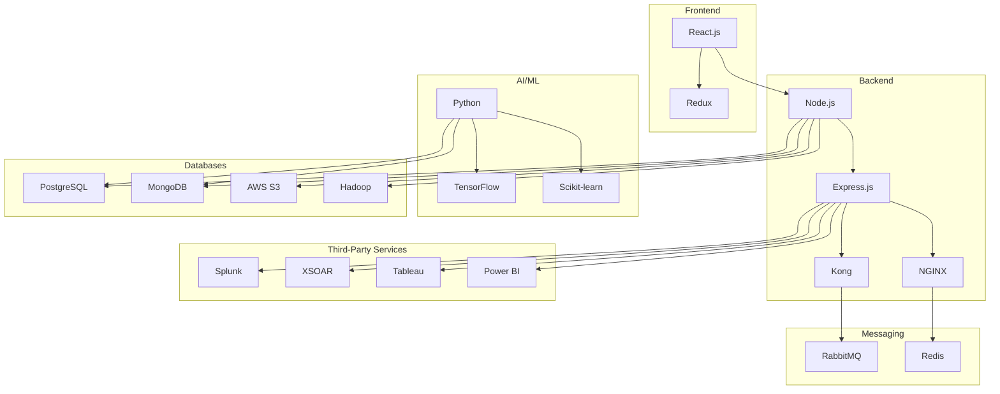

## SECURITY CONSIDERATIONS

### AUTHENTICATION AND AUTHORIZATION

The platform employs robust authentication and authorization mechanisms to ensure that only authorized users can access and perform actions within the system.

#### Authentication

- **Multi-Factor Authentication (MFA)**: All users must authenticate using MFA, combining something they know (password) with something they have (e.g., OTP via mobile device).
- **OAuth 2.0 and JWT**: Utilizes OAuth 2.0 for secure authorization and JSON Web Tokens (JWT) for stateless authentication across APIs.
- **Biometric Authentication**: Supports biometric methods such as fingerprint and facial recognition for enhanced security on compatible devices.

#### Authorization

- **Role-Based Access Control (RBAC)**: Implements RBAC to assign permissions based on user roles, ensuring users have access only to the functionalities necessary for their role.
- **Granular Permissions**: Defines specific permissions for various actions, such as view, create, edit, and delete, ensuring fine-grained access control.
- **Dynamic Permission Adjustment**: Allows for real-time updates to user roles and permissions through the User and System Management interface.

#### Authorization Matrix

| **Role**            | **Permissions**                                                                                         |
|---------------------|---------------------------------------------------------------------------------------------------------|
| **Security Analyst**| View incidents, execute playbooks, access recommendations, interact with AI assistant                    |
| **Administrator**   | Manage users and roles, configure system settings, oversee integrations, access all incident data        |
| **IT Manager**      | View performance metrics, manage system configurations, access compliance and audit logs                 |
| **Guest User**      | View dashboard summaries, receive notifications, limited access to incident status without modification   |

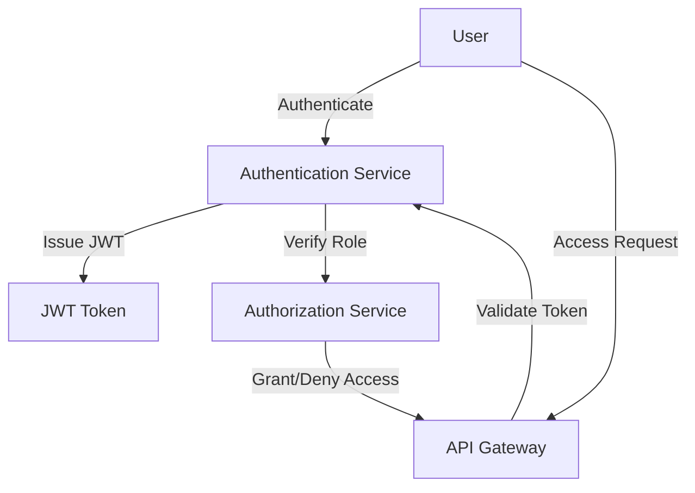

### DATA SECURITY

Ensuring the security and integrity of sensitive information is paramount. The platform implements comprehensive data security measures to protect data both at rest and in transit.

#### Encryption

- **Data at Rest**: Utilizes AES-256 encryption to secure all sensitive data stored in databases and data lakes.
- **Data in Transit**: Implements TLS 1.2+ to encrypt data exchanged between clients, servers, and integrated third-party services.
- **Key Management**: Employs secure key management practices, including regular rotation and restricted access to encryption keys.

#### Data Anonymization

- **Sensitive Data Handling**: Applies data anonymization techniques to mask personally identifiable information (PII) and sensitive organizational data where applicable.
- **Access Controls**: Ensures that anonymized data cannot be re-identified by unauthorized users through strict access controls and data handling policies.

#### Data Integrity

- **Hashing and Checksums**: Implements hashing algorithms (e.g., SHA-256) and checksums to verify the integrity of data during storage and transmission.
- **Audit Trails**: Maintains comprehensive audit logs to track data modifications and access, ensuring accountability and traceability.

#### Data Segmentation

| **Data Type**        | **Storage Solution**        | **Security Measures**                           |
|----------------------|-----------------------------|-------------------------------------------------|
| **Structured Data**  | PostgreSQL                  | AES-256 encryption, RBAC, regular backups       |
| **Unstructured Data**| MongoDB                     | AES-256 encryption, access controls, replication|
| **Threat Intelligence**| AWS S3, Hadoop Data Lake   | TLS encryption, data anonymization, redundancy  |

### SECURITY PROTOCOLS

The platform adheres to industry-standard security protocols and implements best practices to maintain a secure and resilient system environment.

#### Communication Protocols

- **TLS 1.2+**: Ensures all data transmissions are encrypted and secure against interception and tampering.
- **Secure API Communication**: All API interactions are conducted over HTTPS with OAuth 2.0 and JWT for authentication and authorization.

#### Security Audits and Assessments

- **Regular Security Audits**: Conducts periodic security audits to identify and mitigate vulnerabilities within the platform.
- **Vulnerability Assessments**: Implements routine vulnerability scanning and penetration testing to proactively address security threats.

#### Incident Response

- **Automated Monitoring**: Continuously monitors system activities and logs for suspicious behavior and unauthorized access attempts.
- **Alerting Mechanisms**: Utilizes the Notification and Alert Interface to promptly inform administrators of critical security events.
- **Response Playbooks**: Leverages AI-generated and predefined playbooks to automate and streamline incident response processes.

#### Compliance Standards

- **GDPR, HIPAA, PCI DSS**: Ensures compliance with relevant data protection and industry-specific regulations through robust data handling and security practices.
- **ISO/IEC 27001:2013 Alignment**: Aligns with ISO/IEC 27001 standards for information security management systems to maintain systematic security governance.

#### Security Protocols Diagram

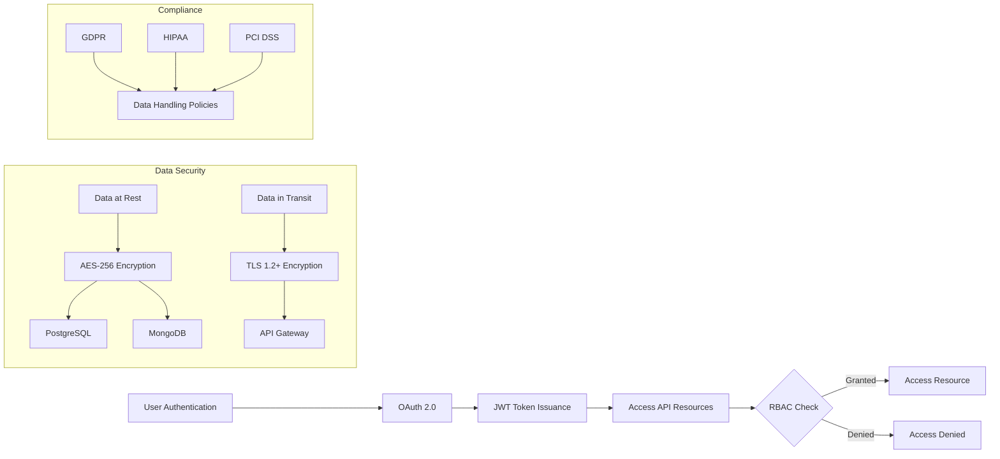

### Security Considerations Summary

The Generative AI-Powered Security Orchestration Platform is designed with a comprehensive security framework that encompasses strong authentication and authorization mechanisms, robust data protection strategies, and adherence to industry-standard security protocols. By implementing these security considerations, the platform ensures the confidentiality, integrity, and availability of sensitive information, while maintaining compliance with relevant regulatory requirements and safeguarding against evolving security threats.

## INFRASTRUCTURE

### DEPLOYMENT ENVIRONMENT

The Generative AI-Powered Security Orchestration Platform is designed to be deployed in a **hybrid environment**, supporting both **cloud-based** and **on-premises** deployments to accommodate varying organizational requirements and existing infrastructure setups.

- **Cloud Deployment**: Utilizes cloud services for scalability, flexibility, and ease of maintenance.
- **On-Premises Deployment**: Offers deployment options within the organization's own data centers to comply with specific regulatory or security requirements.
- **Hybrid Deployment**: Combines both cloud and on-premises resources, allowing organizations to leverage the benefits of both environments while maintaining control over sensitive data.

### CLOUD SERVICES

The platform leverages the following cloud services to ensure high availability, scalability, and performance:

| **Service**          | **Provider** | **Purpose**                                                         | **Justification**                                                                                     |
|----------------------|--------------|---------------------------------------------------------------------|--------------------------------------------------------------------------------------------------------|
| **Compute Instances**| AWS EC2      | Hosts application servers and backend services.                    | Provides scalable and reliable compute resources with a wide range of instance types.                   |
| **Storage**          | AWS S3       | Stores unstructured data, logs, and backups.                       | Offers durable, scalable, and cost-effective object storage with robust security features.              |
| **Kubernetes Service**| AWS EKS      | Manages containerized applications and orchestration.              | Simplifies Kubernetes cluster management, ensuring high availability and seamless scalability.           |
| **Managed Database Services**| AWS RDS (PostgreSQL), AWS DocumentDB (MongoDB-compatible)| Hosts relational and NoSQL databases.                                     | Provides managed database services with automated backups, scaling, and maintenance.                     |
| **Data Lake**        | AWS Lake Formation | Aggregates and manages large volumes of raw data.              | Facilitates centralized data storage and processing for AI and analytics purposes.                      |
| **CI/CD Services**   | AWS CodePipeline, AWS CodeBuild | Automates build, test, and deployment processes. | Integrates seamlessly with other AWS services, ensuring a streamlined CI/CD pipeline.                    |
| **Monitoring and Logging** | AWS CloudWatch, AWS Elasticsearch | Real-time monitoring, logging, and alerting.            | Provides comprehensive visibility into system performance and security events.                          |
| **Security Services**| AWS IAM, AWS KMS | Manages user access and encryption keys.                        | Ensures secure access control and robust data encryption across all services.                           |

### CONTAINERIZATION

The platform utilizes **Docker** for containerizing applications, ensuring consistency across development, testing, and production environments.

- **Benefits**:
  - **Portability**: Containers can run consistently across different environments.
  - **Isolation**: Provides isolated environments for applications, enhancing security and stability.
  - **Efficiency**: Enables efficient resource utilization and faster deployment times.
  
#### Docker Configuration

| **Component**            | **Image**                      | **Purpose**                                      |
|--------------------------|--------------------------------|--------------------------------------------------|
| **Frontend Application** | `react-app:latest`             | Hosts the React.js frontend interface.           |
| **Backend Service**      | `node-backend:latest`          | Runs the Node.js and Express.js backend services.|
| **AI Engine**            | `python-ai-engine:latest`      | Executes Python-based AI and machine learning models.|
| **Database Services**    | `postgres:latest`, `mongo:latest`| Hosts PostgreSQL and MongoDB databases.         |
| **Monitoring Tools**     | `prometheus:latest`, `grafana:latest`| Provides system monitoring and visualization. |

### ORCHESTRATION

The platform employs **Kubernetes** for container orchestration, ensuring efficient deployment, scaling, and management of containerized applications.

#### Kubernetes Architecture

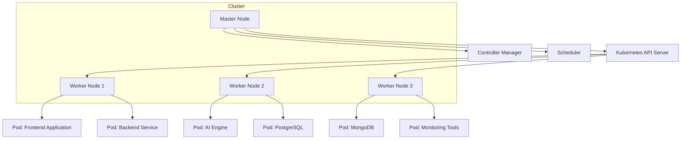

#### Kubernetes Features

- **Automatic Scaling**: Adjusts the number of active containers based on load and performance metrics.
- **Self-Healing**: Automatically replaces failed containers and reschedules them as needed.
- **Service Discovery and Load Balancing**: Distributes network traffic efficiently across containers.
- **Declarative Configuration**: Utilizes YAML manifests for defining the desired state of the infrastructure.

### CI/CD PIPELINE

The platform's **Continuous Integration and Continuous Deployment (CI/CD)** pipeline automates the process of building, testing, and deploying applications, ensuring rapid and reliable updates.

#### CI/CD Workflow

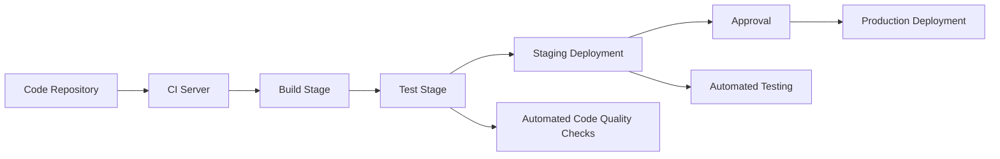

#### CI/CD Tools and Stages

| **Stage**          | **Tools**          | **Description**                                                                    |
|--------------------|--------------------|------------------------------------------------------------------------------------|
| **Code Integration**| GitHub/GitLab      | Hosts the code repository with version control and collaboration features.         |
| **Build**          | AWS CodeBuild      | Compiles and builds application artifacts from source code.                        |
| **Testing**        | AWS CodePipeline with AWS CodeBuild | Executes automated unit, integration, and security tests to ensure code quality and functionality.|
| **Deployment**     | AWS CodeDeploy, Kubernetes | Automates the deployment of applications to staging and production environments.   |
| **Approval**       | Manual/Automated   | Incorporates manual approvals or automated triggers for deploying to production.  |
| **Monitoring**     | AWS CloudWatch, Prometheus | Continuously monitors deployed applications for performance and reliability.      |

#### CI/CD Pipeline Benefits

- **Automation**: Reduces manual intervention, minimizing errors and accelerating the deployment process.
- **Consistency**: Ensures uniform deployment practices across different environments.
- **Rapid Feedback**: Provides immediate feedback on code changes through automated testing.
- **Scalability**: Supports the deployment of large-scale applications with multiple microservices.

---

# APPENDICES

## Additional Technical Information

_No additional technical information is available at this time._

## GLOSSARY

| Term                        | Definition                                                                                     |
|-----------------------------|------------------------------------------------------------------------------------------------|
| **AI (Artificial Intelligence)** | Technology that enables machines to mimic human intelligence, including learning and problem-solving. |
| **API (Application Programming Interface)** | A set of protocols and tools for building software and enabling communication between different software applications. |
| **GDPR (General Data Protection Regulation)** | A regulation in EU law on data protection and privacy for individuals within the European Union. |
| **HIPAA (Health Insurance Portability and Accountability Act)** | A US legislation that provides data privacy and security provisions for safeguarding medical information. |
| **PCI DSS (Payment Card Industry Data Security Standard)** | A set of security standards designed to ensure that all companies that accept, process, store or transmit credit card information maintain a secure environment. |
| **RBAC (Role-Based Access Control)** | A method of regulating access to resources based on the roles of individual users within an organization. |
| **SIEM (Security Information and Event Management)** | A solution that provides real-time analysis of security alerts generated by applications and network hardware. |
| **SOAR (Security Orchestration, Automation, and Response)** | Technologies that enable organizations to collect security threats data and respond to security events with little or no human assistance. |
| **TLS (Transport Layer Security)** | A cryptographic protocol designed to provide secure communication over a computer network. |
| **STIX (Structured Threat Information Expression)** | A language and serialization format used to exchange cyber threat intelligence (CTI). |
| **TAXII (Trusted Automated eXchange of Indicator Information)** | A set of protocols for exchanging cyber threat information using STIX. |
| **MTTD (Mean Time to Detect)** | The average time taken to detect a security incident. |
| **MTTR (Mean Time to Respond)** | The average time taken to respond to and resolve a security incident. |

## ACRONYMS

| Acronym | Expanded Form                                              |
|---------|------------------------------------------------------------|
| **AI**      | Artificial Intelligence                                    |
| **API**     | Application Programming Interface                          |
| **GDPR**    | General Data Protection Regulation                         |
| **HIPAA**   | Health Insurance Portability and Accountability Act        |
| **PCI DSS** | Payment Card Industry Data Security Standard               |
| **RBAC**    | Role-Based Access Control                                  |
| **SIEM**    | Security Information and Event Management                 |
| **SOAR**    | Security Orchestration, Automation, and Response          |
| **TLS**     | Transport Layer Security                                   |
| **STIX**    | Structured Threat Information Expression                   |
| **TAXII**   | Trusted Automated eXchange of Indicator Information        |
| **MTTD**    | Mean Time to Detect                                        |
| **MTTR**    | Mean Time to Respond                                       |

## ADDITIONAL REFERENCES

- **ISO/IEC 27001:2013**: Information Security Management Systems — Requirements.
- **NIST SP 800-53**: Security and Privacy Controls for Information Systems and Organizations.
- **OWASP Top Ten**: A standard awareness document for developers and web application security.
- **Splunk Documentation**: [https://docs.splunk.com](https://docs.splunk.com)
- **XSOAR Documentation**: [https://xsoar.pan.dev](https://xsoar.pan.dev)
- **PostgreSQL Documentation**: [https://www.postgresql.org/docs/](https://www.postgresql.org/docs/)
- **MongoDB Documentation**: [https://docs.mongodb.com/](https://docs.mongodb.com/)
- **OAuth 2.0 Specifications**: [https://oauth.net/2/](https://oauth.net/2/)
- **RESTful API Design Guidelines**: [https://restfulapi.net/](https://restfulapi.net/)
- **TLS 1.2 Specification**: [https://tools.ietf.org/html/rfc5246](https://tools.ietf.org/html/rfc5246)

---